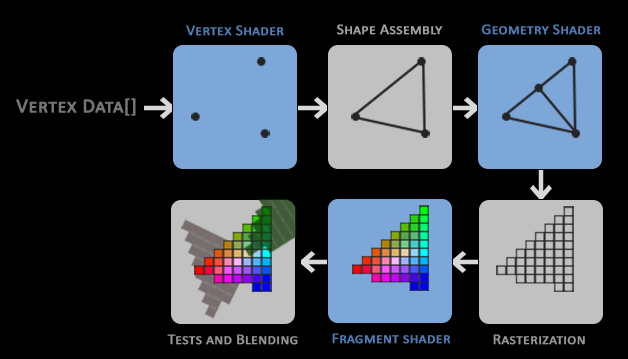
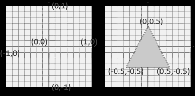
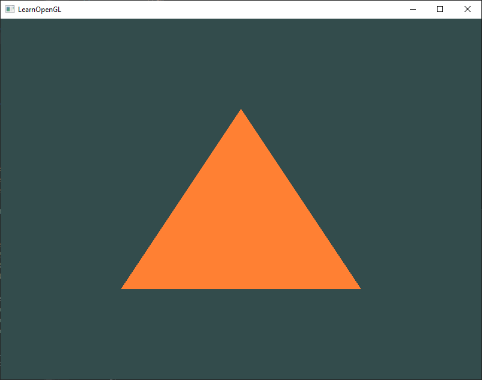

# [Getting Started : Hello Triangle](https://learnopengl.com/Getting-started/Hello-Triangle)

OpenGL에서는 모든 것이 3D 공간 안에서 이루어지지만, 화면 또는 창은 픽셀의 2D 배열입니다. 따라서 OpenGL의 주요 작업 중 큰 부분은 3D 좌표를 화면에 맞는 2D 픽셀로 변환하는 것입니다. 3D 좌표를 2D 픽셀로 변환하는 과정은 OpenGL의 그래픽 파이프라인(graphics pipeline)에 의해 관리됩니다. 그래픽 파이프라인은 크게 두 부분으로 나눌 수 있습니다: 첫 번째 부분은 3D 좌표를 2D 좌표로 변환하고, 두 번째 부분은 2D 좌표를 실제로 색상이 있는 픽셀로 변환합니다. 이 장에서는 그래픽 파이프라인에 대해 간략히 설명하고, 어떻게 이를 활용하여 멋진 픽셀을 만들 수 있는지 알아보겠습니다.

그래픽 파이프라인은 3D 좌표 집합을 입력으로 받아 화면에 색상이 있는 2D 픽셀로 변환합니다. 그래픽 파이프라인은 여러 단계로 나눌 수 있으며, 각 단계는 이전 단계의 출력을 입력으로 필요로 합니다. 이러한 단계들은 각각 특화된 기능을 가지고 있으며 병렬로 실행될 수 있습니다. 현재의 그래픽 카드는 이러한 병렬 처리 특성을 갖기 위해 많은 수의 작은 처리 코어를 가지고 있습니다. 그래픽 파이프라인 내에서 데이터를 빠르게 처리하기 위해 이러한 코어들은 GPU 상에서 각 파이프라인 단계마다 작은 프로그램을 실행합니다. 이 작은 프로그램들을 셰이더(shader)라고 합니다.

개발자는 일부 셰이더를 구성할 수 있으며, 이를 통해 기존의 기본 셰이더를 대체하는 사용자 정의 셰이더를 작성할 수 있습니다. 이를 통해 파이프라인의 특정 부분에 대해 더 세밀한 제어를 할 수 있으며, GPU에서 실행되므로 소중한 CPU 시간을 절약할 수도 있습니다. 셰이더는 OpenGL Shading Language (GLSL)로 작성되며, 다음 장에서 자세히 알아보겠습니다.

아래에는 그래픽 파이프라인의 모든 단계를 추상적으로 표현한 것이 있습니다. 파란색으로 표시된 부분은 우리가 직접 셰이더를 삽입할 수 있는 부분임을 유의해주세요.



보시다시피, 그래픽 파이프라인은 버텍스 데이터를 완전히 렌더링된 픽셀로 변환하는 과정을 다루는 여러 섹션으로 구성되어 있습니다. 우리는 파이프라인의 각 부분을 간단히 설명하여 파이프라인이 어떻게 작동하는지에 대한 전반적인 개요를 제공하겠습니다.

그래픽 파이프라인에 대한 입력으로, 우리는 "Vertex Data"라고 불리는 배열에 세 개의 3D 좌표로 이루어진 삼각형을 형성하는 데이터를 전달합니다. 이 버텍스 데이터는 버텍스들의 집합입니다. 각각의 버텍스는 3D 좌표 당 하나의 데이터 집합입니다. 이 버텍스의 데이터는 우리가 원하는 어떤 데이터든 포함할 수 있는 버텍스 속성을 사용하여 표현됩니다. 그러나 간단함을 위해 각 버텍스가 3D 위치와 색상값만으로 구성된다고 가정해 봅시다.

> OpenGL이 좌표와 색상값의 집합을 어떻게 처리해야 하는지 알기 위해서는 데이터로 어떤 렌더링 유형을 형성하고자 하는지 알려줘야 합니다. 데이터를 점들의 집합, 삼각형들의 집합, 또는 긴 선 하나로 렌더링하길 원하는지를 나타내기 위한 힌트가 필요합니다. 이러한 힌트는 프리미티브(primitives)라고 불리며, 그리기 명령을 호출하는 동안 OpenGL에 제공됩니다. 이러한 힌트 중 일부는 GL_POINTS, GL_TRIANGLES, GL_LINE_STRIP 등입니다.

파이프라인의 첫 번째 부분은 버텍스 셰이더(vertex shader)입니다. 버텍스 셰이더는 단일 버텍스를 입력으로 받습니다. 버텍스 셰이더의 주요 목적은 3D 좌표를 다른 3D 좌표로 변환하는 것이며 (이에 대해서는 나중에 자세히 설명하겠습니다), 버텍스 셰이더를 사용하여 버텍스 속성에 대한 기본적인 처리를 수행할 수 있습니다.

버텍스 셰이더 단계의 출력은 선택적으로 지오메트리 셰이더로 전달됩니다. 지오메트리 셰이더는 프리미티브를 형성하는 버텍스들의 집합을 입력으로 받으며, 새로운 버텍스를 생성하여 새로운(또는 다른) 프리미티브를 형성하는 능력이 있습니다. 이 예시에서는 주어진 형태에서 두 번째 삼각형을 생성합니다.

프리미티브 어셈블리 단계는 버텍스(또는 지오메트리) 셰이더로부터 모든 버텍스(또는 버텍스, GL_POINTS인 경우)를 입력으로 받아 하나 이상의 프리미티브를 형성하는 점들을 모아주는 역할을 합니다. 이 경우에는 삼각형이 주어진 형태로 모든 점을 어셈블리합니다.

지오메트리 셰이더의 출력은 그 다음 래스터라이제이션 단계로 전달됩니다. 래스터라이제이션은 결과적으로 형성된 프리미티브를 최종 화면에 해당하는 픽셀로 매핑하며, 이로 인해 프래그먼트(fragment)가 생성됩니다. 프래그먼트 셰이더가 실행되기 전에 클리핑이 수행됩니다. 클리핑은 뷰 영역 밖에 있는 모든 프래그먼트를 버리는 작업으로, 성능을 향상시킵니다.

> OpenGL에서 프래그먼트(fragment)는 OpenGL이 단일 픽셀을 렌더링하는 데 필요한 모든 데이터를 포함합니다.

프래그먼트 셰이더의 주요 목적은 픽셀의 최종 색상을 계산하는 것이며, 일반적으로 고급 OpenGL 효과가 적용되는 단계입니다. 보통 프래그먼트 셰이더에는 3D 장면에 대한 데이터가 포함되어 있으며, 이를 사용하여 최종 픽셀 색상을 계산할 수 있습니다(조명, 그림자, 광원의 색상 등).

모든 적절한 색상 값이 결정된 후, 최종 개체는 추가적인 알파 테스트 및 블렌딩 단계를 거치게 됩니다. 이 단계에서는 프래그먼트의 해당하는 깊이(depth) 값 및 스텐실(stencil) 값(나중에 설명하겠습니다)을 확인하고, 이를 사용하여 결과적인 프래그먼트가 다른 개체의 앞이나 뒤에 있는지를 확인하고 그에 따라 폐기 여부를 결정합니다. 이 단계에서는 알파 값(알파 값은 개체의 불투명도를 정의하는 값)도 확인하고, 개체를 블렌딩합니다. 따라서 프래그먼트 셰이더에서 픽셀의 출력 색상이 계산되었더라도, 여러 개의 삼각형을 렌더링할 때 최종 픽셀 색상은 완전히 다른 값이 될 수 있습니다.

그래픽 파이프라인은 매우 복잡하며 구성 가능한 많은 부분으로 구성되어 있습니다. 그러나 대부분의 경우에는 버텍스 셰이더와 프래그먼트 셰이더만 다루면 됩니다. 지오메트리 셰이더는 선택적이며 일반적으로 기본 셰이더로 남겨집니다. 또한 여기에는 테셀레이션 단계와 변환 피드백 루프가 표시되지 않았지만, 이는 나중에 다루기로 합시다.

현대적인 OpenGL에서는 적어도 직접적으로 버텍스 셰이더와 프래그먼트 셰이더를 정의해야 합니다(GPU에는 기본 버텍스/프래그먼트 셰이더가 없습니다). 이러한 이유로 현대적인 OpenGL을 학습하기 시작하는 것은 종종 어렵습니다. 첫 번째 삼각형을 렌더링하기 위해서는 많은 지식이 요구되기 때문입니다. 그러나 이 장의 끝에서 삼각형을 렌더링할 수 있게 되면, 그래픽 프로그래밍에 대해 훨씬 더 많은 것을 알게 될 것입니다.
<br><br>


## Vertex Input

무언가를 그리기 시작하려면 먼저 OpenGL에 입력 버텍스 데이터를 제공해야 합니다. OpenGL은 3D 그래픽 라이브러리이기 때문에 OpenGL에서 지정하는 모든 좌표는 3D(x, y 및 z 좌표)입니다. OpenGL은 단순히 모든 3D 좌표를 화면의 2D 픽셀로 변환하는 것이 아니라, OpenGL은 3D 좌표를 처리할 때 특정 범위 내에 있는 좌표만을 다룹니다. 이 범위는 x, y 및 z 축 모두에서 -1.0과 1.0 사이입니다. 이렇게 불리는 정규화된 장치 좌표 범위 내에 있는 모든 좌표는 화면에 나타나게 됩니다(이 범위 외의 좌표는 나타나지 않습니다).

정확히 한 개의 삼각형을 렌더링하려면 각각의 버텍스가 3D 위치를 갖는 총 세 개의 버텍스를 지정하고 싶습니다. 이러한 버텍스들을 정규화된 장치 좌표(OpenGL의 가시 영역)에서 정의하고, 이를 float 배열에 저장합니다:

```
float vertices[] = {
    -0.5f, -0.5f, 0.0f,
     0.5f, -0.5f, 0.0f,
     0.0f,  0.5f, 0.0f
};  
```

OpenGL는 3D 공간에서 작동하기 때문에 각 버텍스의 z 좌표를 0.0으로 설정하여 2D 삼각형을 렌더링합니다. 이렇게 하면 삼각형의 깊이(depth)가 동일하게 유지되어 2D처럼 보이게 됩니다.

> Normalized Device Coordinates (NDC)
버텍스 좌표가 버텍스 셰이더에서 처리된 후에는 정규화된 장치 좌표로 변환되어야 합니다. 이는 x, y 및 z 값이 -1.0에서 1.0 사이로 변동하는 작은 공간입니다. 이 범위를 벗어나는 좌표는 폐기되거나 클리핑되어 화면에 표시되지 않습니다. 아래에서는 정규화된 장치 좌표에서 지정한 삼각형을 볼 수 있습니다(z 축은 무시됩니다):
  
일반적인 화면 좌표와 달리, 정규화된 장치 좌표에서는 양의 y축이 위쪽으로 향하며, (0,0) 좌표는 그래프의 중심에 위치합니다. 최종적으로 모든 (변환된) 좌표를 이 좌표 공간에 맞추어야 하며, 그렇지 않으면 화면에 표시되지 않을 수 있습니다.  
정규화된 장치 좌표(NDC 좌표)는 glViewport로 제공된 데이터를 사용하여 뷰포트 변환(viewport transform)을 거쳐 화면 좌표(screen-space 좌표)로 변환됩니다. 이러한 결과적인 화면 좌표는 프래그먼트 셰이더의 입력으로 사용되어 프래그먼트로 변환됩니다.

버텍스 데이터가 정의되었으므로 이를 그래픽 파이프라인의 첫 번째 단계인 버텍스 셰이더의 입력으로 보내고자 합니다. 이를 위해 GPU 상에 버텍스 데이터를 저장할 메모리를 생성하고, OpenGL이 메모리를 어떻게 해석해야 하는지를 구성하고, 데이터를 그래픽 카드에 보내는 방법을 지정합니다. 그런 다음 버텍스 셰이더는 해당 메모리에서 지정한 만큼의 버텍스를 처리합니다.

이 메모리는 GPU의 메모리에 대량의 버텍스를 저장할 수 있는 버텍스 버퍼 객체(Vertex Buffer Object, VBO)를 통해 관리됩니다. 이러한 버퍼 객체를 사용하는 장점은 한 번에 대량의 데이터를 그래픽 카드에 한꺼번에 보낼 수 있으며, 메모리가 충분한 경우 그곳에 유지할 수 있으므로 데이터를 하나의 버텍스씩 보내지 않아도 됩니다. CPU에서 그래픽 카드로 데이터를 보내는 것은 상대적으로 느리기 때문에 가능한 한 많은 데이터를 한 번에 보내려고 합니다. 데이터가 그래픽 카드의 메모리에 있는 경우, 버텍스 셰이더는 버텍스에 대한 거의 즉시적인 액세스를 가지므로 매우 빠릅니다.

버텍스 버퍼 객체(Vertex Buffer Object, VBO)는 우리가 OpenGL 챕터에서 논의한 OpenGL 객체의 첫 번째 예시입니다. OpenGL의 모든 객체와 마찬가지로, 이 버퍼는 해당 버퍼에 대응하는 고유한 ID를 가지고 있으므로 glGenBuffers 함수를 사용하여 버퍼 ID로 하나를 생성할 수 있습니다:

```
unsigned int VBO;
glGenBuffers(1, &VBO);
```

OpenGL은 다양한 종류의 버퍼 객체를 가지고 있으며, 버텍스 버퍼 객체의 버퍼 유형은 GL_ARRAY_BUFFER입니다. OpenGL은 서로 다른 버퍼 유형을 가진 여러 버퍼에 동시에 바인딩할 수 있습니다. 새로 생성한 버퍼를 GL_ARRAY_BUFFER 타겟에 바인딩하기 위해 glBindBuffer 함수를 사용할 수 있습니다:

```
glBindBuffer(GL_ARRAY_BUFFER, VBO);
```

이후로는 (GL_ARRAY_BUFFER 타겟에 대한) 버퍼 호출은 현재 바인딩된 버퍼, 즉 VBO를 구성하는 데 사용됩니다. 그런 다음 glBufferData 함수를 호출하여 이전에 정의한 버텍스 데이터를 버퍼의 메모리로 복사할 수 있습니다:

```
glBufferData(GL_ARRAY_BUFFER, sizeof(vertices), vertices, GL_STATIC_DRAW);
```

glBufferData는 현재 바인딩된 버퍼로 사용자 정의 데이터를 복사하기 위해 특별히 지정된 함수입니다. 첫 번째 인자는 데이터를 복사하려는 버퍼의 유형을 지정합니다. 즉, 현재 GL_ARRAY_BUFFER 타겟에 바인딩된 버텍스 버퍼 객체입니다. 두 번째 인자는 버퍼에 전달할 데이터의 크기(바이트 단위)를 지정합니다. 일반적으로 버텍스 데이터의 sizeof를 사용하여 크기를 지정합니다. 세 번째 매개변수는 실제로 전송하려는 데이터입니다.

네 번째 매개변수는 그래픽 카드가 주어진 데이터를 어떻게 관리할지를 지정합니다. 이는 세 가지 형태를 취할 수 있습니다.

- GL_STREAM_DRAW: 데이터는 한 번 설정되고 GPU에서 최대로 몇 번 사용됩니다.
- GL_STATIC_DRAW: 데이터는 한 번 설정되고 많은 횟수로 사용됩니다.
- GL_DYNAMIC_DRAW: 데이터가 자주 변경되고 많은 횟수로 사용됩니다.

삼각형의 위치 데이터는 변경되지 않고 많이 사용되며 렌더링 호출마다 동일하므로 가장 적합한 사용 유형은 GL_STATIC_DRAW입니다. 예를 들어, 자주 변경될 가능성이 있는 데이터를 가진 버퍼의 경우 GL_DYNAMIC_DRAW 사용 유형은 그래픽 카드가 빠른 쓰기를 가능하게 하는 메모리에 데이터를 배치합니다.

지금까지 VBO라는 이름의 버텍스 버퍼 객체로 그래픽 카드의 메모리에 버텍스 데이터를 저장했습니다. 이제 실제로 이 데이터를 처리하는 버텍스 셰이더와 프래그먼트 셰이더를 만들어 보겠습니다. 이제 이들을 만들어봅시다.
<br><br>


## Vertex Shader

버텍스 셰이더는 우리와 같은 사람들에 의해 프로그램 가능한 셰이더 중 하나입니다. 모던 OpenGL에서는 렌더링을 수행하려면 적어도 버텍스 셰이더와 프래그먼트 셰이더를 설정해야 합니다. 따라서 첫 번째 삼각형을 그리기 위해 매우 간단한 두 개의 셰이더를 설정하여 셰이더에 대해 간략히 소개하겠습니다. 다음 장에서는 셰이더에 대해 더 자세히 다룰 예정입니다.

첫 번째로 해야 할 일은 GLSL(OpenGL Shading Language)로 버텍스 셰이더를 작성한 다음 이 셰이더를 컴파일하여 애플리케이션에서 사용할 수 있도록 하는 것입니다. 아래에서는 매우 기본적인 GLSL 형식의 버텍스 셰이더 소스 코드를 찾으실 수 있습니다:

```
#version 330 core
layout (location = 0) in vec3 aPos;

void main()
{
    gl_Position = vec4(aPos.x, aPos.y, aPos.z, 1.0);
}
```

보시다시피, GLSL은 C와 유사한 구문을 가지고 있습니다. 각 셰이더는 버전 선언으로 시작합니다. OpenGL 3.3 이상부터 GLSL 버전 번호는 OpenGL 버전과 일치합니다 (예를 들어 GLSL 버전 420은 OpenGL 버전 4.2와 대응합니다). 우리는 또한 명시적으로 core 프로파일 기능을 사용한다고 언급합니다.

다음으로, 버텍스 셰이더에서 모든 입력 버텍스 어트리뷰트를 in 키워드를 사용하여 선언합니다. 현재는 위치 데이터만 신경쓰므로 하나의 버텍스 어트리뷰트만 필요합니다. GLSL에는 포스트픽스 숫자에 따라 1에서 4개의 float를 포함하는 벡터 데이터 타입이 있습니다. 각 버텍스는 3D 좌표를 가지므로, aPos라는 이름의 vec3 입력 변수를 생성합니다. 또한, layout (location = 0)을 통해 입력 변수의 위치를 명시적으로 설정하고, 이 위치가 왜 필요한지는 나중에 알아볼 것입니다.

> Vector  
그래픽스 프로그래밍에서는 벡터라는 수학적인 개념을 자주 사용합니다. 벡터는 어떤 공간에서 위치/방향을 깔끔하게 나타내며 유용한 수학적 특성을 갖고 있습니다. GLSL에서의 벡터는 최대 크기가 4이며, 각 값은 vec.x, vec.y, vec.z 및 vec.w를 통해 각각 공간에서의 좌표를 가져올 수 있습니다. vec.w 구성 요소는 공간에서의 위치로 사용되지 않지만, perspective division이라는 개념에 사용됩니다. 나중에 벡터에 대해 더 자세히 다룰 예정입니다.

vertex shader의 출력을 설정하기 위해 미리 정의된 gl_Position 변수에 위치 데이터를 할당해야 합니다. 이 변수는 내부적으로 vec4로 구성되어 있습니다. main 함수의 끝에서 gl_Position에 설정한 값은 vertex shader의 출력으로 사용됩니다. 우리의 입력은 크기가 3인 벡터이므로 이를 크기가 4인 벡터로 캐스트해야 합니다. 이를 위해 vec4의 생성자에 vec3 값을 넣고 w 구성 요소를 1.0f로 설정할 수 있습니다 (나중에 이에 대해 설명하겠습니다).

현재의 vertex shader는 아마도 상상할 수 있는 가장 간단한 vertex shader일 것입니다. 왜냐하면 우리는 입력 데이터에 아무런 처리도 하지 않고 그대로 출력으로 전달했기 때문입니다. 실제 응용 프로그램에서 입력 데이터는 일반적으로 정규화된 장치 좌표(Normalized Device Coordinates)에 이미 있지 않기 때문에 먼저 입력 데이터를 OpenGL의 가시 영역 내에 있는 좌표로 변환해야 합니다.
<br><br>


## Compiling a shader


지금은 vertex shader의 소스 코드를 const C 문자열로 코드 파일의 맨 위에 저장합니다.

```
const char *vertexShaderSource = "#version 330 core\n"
    "layout (location = 0) in vec3 aPos;\n"
    "void main()\n"
    "{\n"
    "   gl_Position = vec4(aPos.x, aPos.y, aPos.z, 1.0);\n"
    "}\0";
```

OpenGL에서 셰이더를 사용하려면 실행 시간에 소스 코드에서 동적으로 컴파일해야 합니다. 첫 번째로 해야 할 일은 셰이더 개체를 생성하는 것입니다. 따라서 vertex shader를 unsigned int로 저장하고 glCreateShader를 사용하여 셰이더를 생성합니다.

```
unsigned int vertexShader;
vertexShader = glCreateShader(GL_VERTEX_SHADER);
```

glCreateShader에 생성할 셰이더의 유형을 인수로 제공합니다. 우리는 버텍스 셰이더를 생성하고 있으므로 GL_VERTEX_SHADER를 전달합니다.

다음으로 셰이더 소스 코드를 셰이더 개체에 첨부하고 셰이더를 컴파일합니다.

```
glShaderSource(vertexShader, 1, &vertexShaderSource, NULL);
glCompileShader(vertexShader);
```

glShaderSource 함수는 첫 번째 인수로 컴파일할 셰이더 개체를 취합니다. 두 번째 인수는 소스 코드로 전달하는 문자열의 수를 지정합니다. 이 경우에는 하나만 전달하므로 1로 설정합니다. 세 번째 인수는 실제 버텍스 셰이더의 소스 코드이며, 네 번째 인수는 NULL로 두면 됩니다.

glCompileShader 함수 호출 이후에 컴파일이 성공했는지 확인하고, 그렇지 않은 경우 어떤 오류가 발견되었는지 확인하여 수정할 수 있습니다. 컴파일 시간 오류를 확인하는 방법은 다음과 같습니다:

```
int  success;
char infoLog[512];
glGetShaderiv(vertexShader, GL_COMPILE_STATUS, &success);
```

먼저 성공 여부를 나타내는 정수와 오류 메시지를 저장할 컨테이너를 정의합니다. 그런 다음 glGetShaderiv를 사용하여 컴파일이 성공했는지 확인합니다. 컴파일에 실패한 경우 glGetShaderInfoLog를 사용하여 오류 메시지를 가져온 다음 해당 오류 메시지를 출력합니다.

```
if(!success)
{
    glGetShaderInfoLog(vertexShader, 512, NULL, infoLog);
    std::cout << "ERROR::SHADER::VERTEX::COMPILATION_FAILED\n" << infoLog << std::endl;
}
```

만약 버텍스 셰이더를 컴파일하는 동안 오류가 감지되지 않았다면, 이제 버텍스 셰이더가 컴파일되었습니다.
<br><br>


## Fragment shader

프래그먼트 셰이더는 삼각형을 렌더링하기 위해 생성하는 두 번째로 마지막 셰이더입니다. 프래그먼트 셰이더는 픽셀의 색상 출력을 계산하는 데 관련되어 있습니다. 간단하게 유지하기 위해, 프래그먼트 셰이더는 항상 주황색에 가까운 색상을 출력합니다.

> 컴퓨터 그래픽스에서 색상은 4개의 값으로 표현됩니다: 빨강, 초록, 파랑 및 알파 (불투명도) 구성요소로, 일반적으로 RGBA로 축약됩니다. OpenGL이나 GLSL에서 색상을 정의할 때 각 구성요소의 강도를 0.0에서 1.0 사이의 값으로 설정합니다. 예를 들어, 빨강을 1.0으로 설정하고 초록을 1.0으로 설정하면 두 색을 혼합한 노란색을 얻을 수 있습니다. 이러한 3가지 색 구성요소를 사용하여 1600만 가지 이상의 다른 색을 생성할 수 있습니다!

```
#version 330 core
out vec4 FragColor;

void main()
{
    FragColor = vec4(1.0f, 0.5f, 0.2f, 1.0f);
} 
```

프래그먼트 셰이더는 하나의 출력 변수만 필요로하며, 이는 최종적으로 계산해야하는 색상 출력을 정의하는 크기 4의 벡터입니다. 우리는 out 키워드를 사용하여 출력 값을 선언할 수 있으며, 여기서는 FragColor로 지정했습니다. 다음으로, 색상 출력에 vec4를 할당하여 오렌지색의 색상과 1.0의 알파 값 (1.0은 완전히 불투명함)을 지정합니다.

프래그먼트 셰이더를 컴파일하는 과정은 버텍스 셰이더와 유사하지만, 이번에는 GL_FRAGMENT_SHADER 상수를 셰이더 유형으로 사용합니다.

```
unsigned int fragmentShader;
fragmentShader = glCreateShader(GL_FRAGMENT_SHADER);
glShaderSource(fragmentShader, 1, &fragmentShaderSource, NULL);
glCompileShader(fragmentShader);
```

이제 두 개의 셰이더가 컴파일되었고, 남은 일은 두 셰이더 객체를 셰이더 프로그램에 링크하는 것입니다. 여기에서도 컴파일 오류를 확인하는 것이 중요합니다!
<br><br>


## Shader program

셰이더 프로그램 객체는 여러 개의 셰이더가 결합된 최종 링크된 버전입니다. 최근에 컴파일된 셰이더를 사용하기 위해 이를 셰이더 프로그램 객체에 링크하고, 물체를 렌더링할 때 이 셰이더 프로그램을 활성화해야 합니다. 활성화된 셰이더 프로그램의 셰이더가 렌더링 호출 시 사용됩니다.

셰이더를 프로그램에 링크할 때는 각 셰이더의 출력을 다음 셰이더의 입력에 연결합니다. 만약 출력과 입력이 일치하지 않으면 링크 오류가 발생할 수 있습니다.

프로그램 객체를 생성하는 것은 간단합니다:

```
unsigned int shaderProgram;
shaderProgram = glCreateProgram();
```

glCreateProgram 함수는 프로그램을 생성하고 새로 생성된 프로그램 객체의 ID 참조를 반환합니다. 이제 이전에 컴파일된 셰이더를 프로그램 객체에 첨부하고 glLinkProgram을 사용하여 링크해야 합니다.

```
glAttachShader(shaderProgram, vertexShader);
glAttachShader(shaderProgram, fragmentShader);
glLinkProgram(shaderProgram);
```

코드는 상당히 명확하게 설명되어 있습니다. 셰이더를 프로그램에 첨부하고 glLinkProgram을 통해 링크합니다.

셰이더 프로그램의 링크가 실패했는지 확인하고 해당하는 로그를 검색하는 것도 컴파일과 마찬가지로 할 수 있습니다. 그러나 glGetShaderiv와 glGetShaderInfoLog 대신 다음을 사용합니다:

```
glGetProgramiv(shaderProgram, GL_LINK_STATUS, &success);
if(!success) {
    glGetProgramInfoLog(shaderProgram, 512, NULL, infoLog);
    ...
}
```

결과는 새로 생성한 프로그램 객체를 인수로 하는 glUseProgram을 호출하여 활성화할 수 있는 프로그램 객체입니다.

```
glUseProgram(shaderProgram);
```

glUseProgram 이후의 모든 셰이더와 렌더링 호출은 이제 이 프로그램 객체(따라서 셰이더)를 사용합니다.

그리고, 셰이더 객체들을 프로그램 객체에 링크한 후에는 삭제하는 것을 잊지 마세요. 우리는 더 이상 그들을 필요로하지 않습니다.

```
glDeleteShader(vertexShader);
glDeleteShader(fragmentShader);  
```

현재 우리는 입력 버텍스 데이터를 GPU로 보내고, GPU에게 버텍스 데이터를 어떻게 처리해야 할지를 버텍스와 프래그먼트 셰이더 내에서 지시했습니다. 거의 다 왔지만 아직 완전히 끝나지는 않았습니다. OpenGL은 아직 메모리 내의 버텍스 데이터를 어떻게 해석해야 하며, 버텍스 데이터를 버텍스 셰이더의 어트리뷰트와 연결해야 하는지를 알지 못합니다. 우리는 친절하게도 OpenGL에게 어떻게 해야 하는지 알려줄 것입니다.
<br><br>


## Linking Vertex Attributes

버텍스 셰이더를 사용하면 우리는 버텍스 어트리뷰트의 형태로 원하는 모든 입력을 지정할 수 있습니다. 이는 매우 유연성을 제공하지만, 입력 데이터의 어느 부분이 버텍스 셰이더의 어느 버텍스 어트리뷰트로 이동해야 하는지를 수동으로 지정해야 한다는 의미입니다. 이는 렌더링하기 전에 OpenGL이 버텍스 데이터를 어떻게 해석해야 하는지를 지정해야 한다는 것을 의미합니다.

우리의 버텍스 버퍼 데이터는 다음과 같은 형식으로 구성되어 있습니다:


- 위치 데이터는 32비트(4바이트) 부동 소수점 값으로 저장됩니다.
- 각 위치는 이러한 값 중 3개로 구성됩니다.
- 각 세트의 값 사이에 공백이나 다른 값은 없습니다. 값은 배열에서 밀접하게 패킹됩니다.
- 데이터의 첫 번째 값은 버퍼의 시작 부분에 있습니다.

이러한 지식을 바탕으로 우리는 glVertexAttribPointer를 사용하여 OpenGL에게 버텍스 데이터를 어떻게 해석해야 하는지 (버텍스 어트리뷰트별로) 알려줄 수 있습니다.

```
glVertexAttribPointer(0, 3, GL_FLOAT, GL_FALSE, 3 * sizeof(float), (void*)0);
glEnableVertexAttribArray(0);
```

함수 glVertexAttribPointer에는 상당히 많은 매개변수가 있으므로 하나씩 주의 깊게 살펴보겠습니다.

- 첫 번째 매개변수는 우리가 구성하려는 버텍스 어트리뷰트를 지정합니다. 버텍스 셰이더에서 위치 버텍스 어트리뷰트의 위치를 layout (location = 0)으로 지정했다는 것을 기억하세요. 이렇게 하면 버텍스 어트리뷰트의 위치가 0으로 설정되며, 이 버텍스 어트리뷰트에 데이터를 전달하려고 하기 때문에 0을 전달합니다.
- 다음 인수는 버텍스 어트리뷰트의 크기를 지정합니다. 버텍스 어트리뷰트는 vec3이므로 3개의 값으로 구성됩니다.
- 세 번째 인수는 데이터의 유형을 지정합니다. 데이터의 유형은 GL_FLOAT이며(GLSL의 vec*는 부동 소수점 값으로 구성됩니다).
- 다음 인수는 데이터를 정규화할지 여부를 지정합니다. 만약 우리가 정수 데이터 유형 (int, byte)를 입력하고 GL_TRUE로 설정한다면, 정수 데이터는 0 (또는 부호 있는 데이터의 경우 -1)에서 1로 변환될 때 부동 소수점으로 정규화됩니다. 하지만 이는 우리에게 관련이 없으므로 GL_FALSE로 설정합니다.
- 다섯 번째 인수는 스트라이드라고 알려져 있으며 연속된 정점 속성 사이의 간격을 알려줍니다. 다음 위치 데이터는 float 크기의 3배 거리에 있으므로 그 값을 스트라이드로 지정합니다. 배열이 단단히 포장되어 있음을 알고 있으므로 (다음 정점 속성 값 사이에 공간이 없음) 스트라이드를 0으로 지정하여 OpenGL이 스트라이드를 결정하도록 할 수도 있습니다 (단, 이 작업은 값이 단단히 포장된 경우에만 작동합니다). 정점 속성이 더 많을 때마다 각 정점 속성 사이의 간격을 신중하게 정의해야 하지만 나중에 더 많은 예를 볼 수 있습니다.
- 마지막 매개변수는 void* 형이므로 이상한 캐스트가 필요합니다. 이것은 버퍼에서 위치 데이터가 시작하는 오프셋입니다. 위치 데이터가 데이터 배열의 시작 부분에 있으므로 이 값은 0입니다. 이 매개변수는 나중에 자세히 살펴보겠습니다

> 각 정점 속성은 VBO가 관리하는 메모리에서 데이터를 가져오며, 어떤 VBO에서 데이터를 가져오는지 (여러 VBO를 가질 수 있음)는 glVertexAttribPointer를 호출할 때 GL_ARRAY_BUFFER에 바인드된 현재 VBO에 의해 결정됩니다. glVertexAttribPointer를 호출하기 전에 이전에 정의된 VBO가 여전히 바인드되어 있으므로 정점 속성 0은 이제 해당 정점 데이터와 연결됩니다.

이제 OpenGL이 정점 데이터를 어떻게 해석해야 하는지 지정했으므로 glEnableVertexAttribArray를 사용하여 정점 속성 위치를 인수로 제공하여 정점 속성을 활성화해야 합니다. 정점 속성은 기본적으로 비활성화되어 있습니다. 그 시점부터 우리는 모든 것을 설정했습니다. 버텍스 버퍼 객체를 사용하여 버텍스 데이터를 버퍼에 초기화하고, 버텍스 셰이더와 프래그먼트 셰이더를 설정하고, OpenGL에 버텍스 데이터를 버텍스 셰이더의 버텍스 속성에 연결하는 방법을 알려주었습니다. OpenGL에서 개체를 그리면 이제 다음과 같이 보일 것입니다:

```
// 0. copy our vertices array in a buffer for OpenGL to use
glBindBuffer(GL_ARRAY_BUFFER, VBO);
glBufferData(GL_ARRAY_BUFFER, sizeof(vertices), vertices, GL_STATIC_DRAW);
// 1. then set the vertex attributes pointers
glVertexAttribPointer(0, 3, GL_FLOAT, GL_FALSE, 3 * sizeof(float), (void*)0);
glEnableVertexAttribArray(0);  
// 2. use our shader program when we want to render an object
glUseProgram(shaderProgram);
// 3. now draw the object 
someOpenGLFunctionThatDrawsOurTriangle();   
```

우리는 개체를 그릴 때마다 이 프로세스를 반복해야 합니다. 많아 보이지 않을 수도 있지만, 5개 이상의 정점 속성이 있고 수백 개의 개체가 있는 경우(드문 일이 아님)를 상상해 보십시오. 적절한 버퍼 객체를 바인딩하고 각 개체의 모든 정점 속성을 구성하는 것은 빠르게 번거로운 프로세스가 됩니다. 모든 상태 구성을 개체에 저장하고 이 개체를 바인딩하여 상태를 복원할 수 있는 방법이 있다면 어떨까요?
<br><br>


## Vertex Array Object

정점 배열 객체(VAO)는 정점 버퍼 객체와 마찬가지로 바인딩할 수 있으며 그 시점부터의 모든 후속 정점 속성 호출은 VAO에 저장됩니다. 이는 정점 속성 포인터를 구성할 때 해당 호출을 한 번만 수행하면 되며 개체를 그릴 때마다 해당 VAO를 바인딩할 수 있다는 장점이 있습니다. 이렇게 하면 다른 정점 데이터 및 속성 구성을 전환하는 것이 다른 VAO를 바인딩하는 것만큼 쉽습니다. 방금 설정한 모든 상태는 VAO에 저장됩니다.

> Core OpenGL은 VAO를 사용해야 합니다. 그래야 OpenGL이 정점 입력을 어떻게 처리할지 알 수 있습니다. VAO를 바인딩하지 않으면 OpenGL은 아무것도 그리지 않을 가능성이 높습니다.

정점 배열 개체는 다음을 저장합니다.
- glEnableVertexAttribArray 또는 glDisableVertexAttribArray에 대한 호출.
- glVertexAttribPointer를 통한 정점 속성 구성.
- glVertexAttribPointer에 대한 호출로 정점 속성과 연결된 버퍼 객체.


VAO 생성 프로세스는 VBO 생성 프로세스와 매우 유사합니다.

```
unsigned int VAO;
glGenVertexArrays(1, &VAO); 
```

VAO를 사용하려면 glBindVertexArray() 함수를 사용하여 VAO를 바인딩하기만 하면 됩니다. 그 후에는 해당 VBO(들)과 attribute pointer(들)을 바인딩/구성하고 나서 나중에 사용하기 위해 VAO를 언바인딩합니다. 개체를 그리려고 할 때마다 개체를 그리기 전에 원하는 설정으로 VAO를 바인딩하기만 하면 됩니다. 코드로 나타내면 다음과 같습니다:

```
// ..:: Initialization code (done once (unless your object frequently changes)) :: ..
// 1. bind Vertex Array Object
glBindVertexArray(VAO);

// 2. copy our vertices array in a buffer for OpenGL to use
glBindBuffer(GL_ARRAY_BUFFER, VBO);
glBufferData(GL_ARRAY_BUFFER, sizeof(vertices), vertices, GL_STATIC_DRAW);

// 3. then set our vertex attributes pointers
glVertexAttribPointer(0, 3, GL_FLOAT, GL_FALSE, 3 * sizeof(float), (void*)0);
glEnableVertexAttribArray(0);  

[...]

// ..:: Drawing code (in render loop) :: ..
// 4. draw the object
glUseProgram(shaderProgram);
glBindVertexArray(VAO);
someOpenGLFunctionThatDrawsOurTriangle();   
```

이게 전부입니다! 지난 몇 백만 페이지 동안 우리가 한 모든 작업은 이 순간, 즉 정점 속성 구성과 사용할 VBO를 저장하는 VAO로 이어졌습니다. 일반적으로 여러 개체를 그리려는 경우 먼저 모든 VAO(그리고 필요한 VBO 및 attribute pointer)를 생성/구성하고 나중에 사용하기 위해 저장합니다. 우리 개체 중 하나를 그리려고 할 때마다 해당 VAO를 가져와 바인딩하고 개체를 그린 다음 VAO를 다시 언바인딩합니다.
<br><br>


## The triangle we've all been waiting for

OpenGL은 우리가 선택한 개체를 그리기 위해 현재 활성화된 셰이더, 이전에 정의된 정점 속성 구성 및 VBO의 정점 데이터(VAO를 통해 간접적으로 바인딩됨)를 사용하여 도형을 그리는 glDrawArrays 함수를 제공합니다.

```
glUseProgram(shaderProgram);
glBindVertexArray(VAO);
glDrawArrays(GL_TRIANGLES, 0, 3);
```

glDrawArrays 함수는 우리가 그리려는 OpenGL 도형 유형을 첫 번째 인수로 사용합니다. 처음에 삼각형을 그리겠다고 말했고 거짓말하는 것을 좋아하지 않기 때문에 GL_TRIANGLES를 전달합니다. 두 번째 인수는 우리가 그리려는 정점 배열의 시작 인덱스를 지정합니다. 우리는 이것을 0으로 두었습니다. 마지막 인수는 우리가 그리려는 정점의 수를 지정합니다. 이는 3입니다(우리의 데이터에서 삼각형 1개만 렌더링하고, 이는 정확히 3개의 정점으로 구성됨).

이제 코드를 컴파일하고 오류가 발생하면 뒤로 탐색해 보세요. 애플리케이션이 컴파일되면 다음 결과를 볼 수 있습니다:



완전한 프로그램의 소스 코드는 [여기](../../02.GettingStarted/04.HelloTriangle.01/main.cpp)에서 찾을 수 있습니다.

만약 출력이 같지 않다면 중간에 잘못된 작업을 했을 가능성이 있으니 전체 소스 코드를 확인하고 누락된 부분이 있는지 확인하십시오.
<br><br>


## Element Buffer Objects

버텍스를 렌더링할 때 논의하고 싶은 마지막 사항이 있습니다. 바로 요소 버퍼 오브젝트(EBO)입니다. 요소 버퍼 오브젝트가 어떻게 작동하는지 설명하기 위해 예를 들어보겠습니다. 삼각형 대신에 직사각형을 그리고 싶다고 가정해봅시다. 우리는 두 개의 삼각형을 사용하여 직사각형을 그릴 수 있습니다 (OpenGL은 주로 삼각형으로 작동합니다). 이렇게 하면 다음과 같은 버텍스 집합이 생성됩니다:


```
float vertices[] = {
    // first triangle
     0.5f,  0.5f, 0.0f,  // top right
     0.5f, -0.5f, 0.0f,  // bottom right
    -0.5f,  0.5f, 0.0f,  // top left 
    // second triangle
     0.5f, -0.5f, 0.0f,  // bottom right
    -0.5f, -0.5f, 0.0f,  // bottom left
    -0.5f,  0.5f, 0.0f   // top left
}; 
```

보시다시피, 지정된 버텍스에는 겹침이 있습니다. bottom right와 top left를 두 번씩 지정하고 있습니다! 이는 동일한 직사각형을 6개 대신 4개의 버텍스로 지정할 수 있는 50%의 오버헤드입니다. 이는 우리가 1000개 이상의 삼각형을 가진 더 복잡한 모델을 가지게 되면 더욱 악화될 것입니다. 그런 모델에서는 겹치는 부분이 많이 발생할 것입니다. 더 좋은 해결책은 고유한 버텍스만 저장하고, 그 버텍스를 그릴 순서를 지정하는 것입니다. 이 경우에는 직사각형에 대해 4개의 버텍스만 저장하면 되고, 어떤 순서로 그리고자 하는지만 지정하면 됩니다. OpenGL이 이와 같은 기능을 제공해준다면 정말 좋을텐데요, 그렇지 않을까요?

다행히도, 요소 버퍼 오브젝트는 정확히 그렇게 작동합니다. EBO는 버텍스 버퍼 오브젝트와 마찬가지로 인덱스를 저장하는 버퍼입니다. OpenGL은 이 인덱스를 사용하여 어떤 버텍스를 그릴지 결정합니다. 이렇게 불리는 인덱스 그리기가 바로 우리의 문제에 대한 해결책입니다. 시작하기 위해 먼저 (고유한) 버텍스와 직사각형을 그리기 위한 인덱스를 지정해야 합니다:

```
float vertices[] = {
     0.5f,  0.5f, 0.0f,  // top right
     0.5f, -0.5f, 0.0f,  // bottom right
    -0.5f, -0.5f, 0.0f,  // bottom left
    -0.5f,  0.5f, 0.0f   // top left 
};
unsigned int indices[] = {  // note that we start from 0!
    0, 1, 3,   // first triangle
    1, 2, 3    // second triangle
};  
```

인덱스를 사용할 때는 6개 대신 4개의 버텍스만 필요한 것을 볼 수 있습니다. 다음으로 요소 버퍼 오브젝트를 생성해야 합니다:

```
unsigned int EBO;
glGenBuffers(1, &EBO);
```

VBO와 비슷하게 EBO를 바인딩하고 glBufferData를 사용하여 인덱스를 버퍼에 복사합니다. 또한, VBO와 마찬가지로 바인딩과 언바인딩 호출 사이에 이러한 호출을 배치하려고 합니다. 다만 이번에는 버퍼 유형으로 GL_ELEMENT_ARRAY_BUFFER를 지정합니다.

```
glBindBuffer(GL_ELEMENT_ARRAY_BUFFER, EBO);
glBufferData(GL_ELEMENT_ARRAY_BUFFER, sizeof(indices), indices, GL_STATIC_DRAW); 
```

이제 버퍼 대상으로 GL_ELEMENT_ARRAY_BUFFER를 사용하는 것을 주목해야 합니다. 마지막으로 glDrawArrays 호출을 glDrawElements로 대체하여 인덱스 버퍼에서 삼각형을 렌더링하려는 것을 나타내야 합니다. glDrawElements를 사용할 때는 현재 바인딩된 요소 버퍼 오브젝트에서 제공되는 인덱스를 사용하여 그리게 됩니다:

```
glBindBuffer(GL_ELEMENT_ARRAY_BUFFER, EBO);
glDrawElements(GL_TRIANGLES, 6, GL_UNSIGNED_INT, 0);
```

첫 번째 인수는 glDrawArrays와 유사하게 그리고자 하는 모드를 지정합니다. 두 번째 인수는 그리려는 요소의 개수 또는 수를 나타냅니다. 우리는 6개의 인덱스를 지정했으므로 총 6개의 버텍스를 그리고자 합니다. 세 번째 인수는 인덱스의 유형으로 GL_UNSIGNED_INT 유형입니다. 마지막 인수를 사용하면 EBO에서 오프셋을 지정할 수 있습니다 (또는 인덱스 배열을 전달할 수도 있지만, 이는 요소 버퍼 오브젝트를 사용하지 않을 때의 경우입니다). 하지만 우리는 이 값을 0으로 둘 것입니다.

glDrawElements 함수는 현재 GL_ELEMENT_ARRAY_BUFFER 대상에 바인딩된 EBO에서 인덱스를 가져옵니다. 이는 인덱스가 있는 개체를 렌더링하려면 해당 EBO를 매번 바인딩해야 한다는 것을 의미합니다. 다시 말하면, 다소 번거로운 과정입니다. 우연히도 버텍스 어레이 오브젝트(VAO)는 요소 버퍼 오브젝트 바인딩을 추적합니다. VAO가 바인딩되는 동안에 바인딩되는 마지막 요소 버퍼 오브젝트가 VAO의 요소 버퍼 오브젝트로 저장됩니다. VAO에 바인딩하면 해당 EBO도 자동으로 바인딩됩니다.


> VAO는 대상이 GL_ELEMENT_ARRAY_BUFFER인 glBindBuffer 호출을 저장합니다. 이는 VAO가 unbind 호출을 저장한다는 것을 의미하기도 합니다. 따라서 VAO를 unbind하기 전에 요소 배열 버퍼를 unbind하지 않도록 주의해야 합니다. 그렇지 않으면 VAO에 구성된 EBO가 없게 됩니다.

최종적인 초기화 및 렌더링 코드는 다음과 같이 보일 것입니다:

```
// ..:: Initialization code :: ..
// 1. bind Vertex Array Object
glBindVertexArray(VAO);
// 2. copy our vertices array in a vertex buffer for OpenGL to use
glBindBuffer(GL_ARRAY_BUFFER, VBO);
glBufferData(GL_ARRAY_BUFFER, sizeof(vertices), vertices, GL_STATIC_DRAW);
// 3. copy our index array in a element buffer for OpenGL to use
glBindBuffer(GL_ELEMENT_ARRAY_BUFFER, EBO);
glBufferData(GL_ELEMENT_ARRAY_BUFFER, sizeof(indices), indices, GL_STATIC_DRAW);
// 4. then set the vertex attributes pointers
glVertexAttribPointer(0, 3, GL_FLOAT, GL_FALSE, 3 * sizeof(float), (void*)0);
glEnableVertexAttribArray(0);  

[...]
  
// ..:: Drawing code (in render loop) :: ..
glUseProgram(shaderProgram);
glBindVertexArray(VAO);
glDrawElements(GL_TRIANGLES, 6, GL_UNSIGNED_INT, 0);
glBindVertexArray(0);
```

프로그램을 실행하면 아래와 같이 이미지가 생성됩니다. 왼쪽 이미지는 익숙할 것이고, 오른쪽 이미지는 와이어프레임 모드로 그려진 직사각형입니다. 와이어프레임 직사각형은 실제로 두 개의 삼각형으로 구성되어 있음을 보여줍니다.


> Wireframe mode  
삼각형을 와이어프레임 모드로 그리려면 glPolygonMode(GL_FRONT_AND_BACK, GL_LINE)을 사용하여 OpenGL이 프리미티브를 그리는 방식을 구성할 수 있습니다. 첫 번째 인수는 모든 삼각형의 전면과 후면에 적용하려는 것을 나타내고, 두 번째 인수는 선으로 그리기를 지정합니다. 이후의 그리기 호출은 glPolygonMode(GL_FRONT_AND_BACK, GL_FILL)을 사용하여 기본값으로 다시 설정하기 전까지 삼각형을 와이어프레임 모드로 렌더링합니다.

만약 오류가 발생한다면, 역으로 작업을 진행하며 빠뜨린 부분이 있는지 확인해보세요. 전체 소스 코드는 [여기](../../02.GettingStarted/04.HelloTriangle.02/main.cpp)에서 찾을 수 있습니다.

삼각형이나 직사각형을 우리가 한 것과 같이 그릴 수 있다면, 축하합니다! 여러분은 현대 OpenGL에서 가장 어려운 부분 중 하나인 첫 번째 삼각형을 그리는 것을 성공적으로 수행했습니다. 이 부분은 첫 번째 삼각형을 그리기 위해 필요한 많은 지식이 필요하기 때문에 어려운 부분입니다. 다행히도 우리는 그 장벽을 넘어섰으며, 다음 장들은 훨씬 이해하기 쉬울 것입니다.