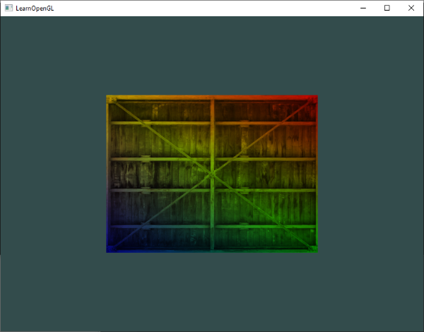
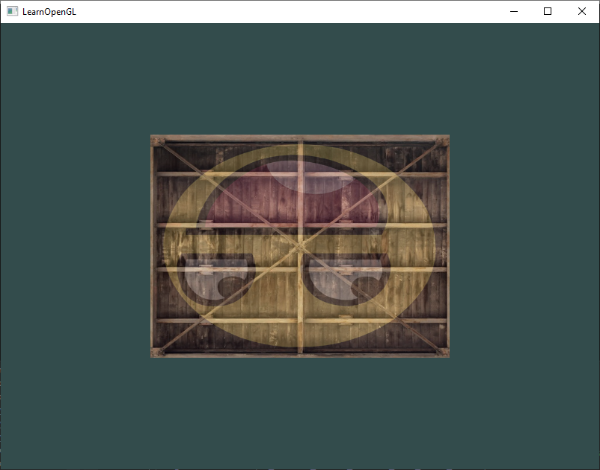
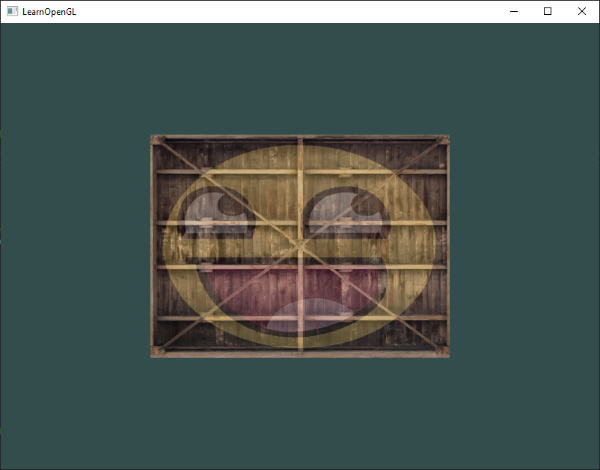

# [Getting Started : Textures](https://learnopengl.com/Getting-started/Textures)

우리는 객체에 더 많은 세부 사항을 추가하기 위해 각 정점에 색상을 사용하여 흥미로운 이미지를 만들 수 있다는 것을 배웠습니다. 그러나 현실적인 효과를 얻기 위해서는 많은 정점이 필요하며, 각 정점마다 색상 속성을 지정해야 합니다. 이는 많은 추가 오버헤드를 차지하므로 각 모델마다 더 많은 정점과 각 정점에 대한 색상 속성이 필요합니다.

일반적으로 예술가와 프로그래머들이 선호하는 방법은 텍스처를 사용하는 것입니다. 텍스처는 객체에 세부 사항을 추가하기 위해 사용되는 2D 이미지입니다 (1D와 3D 텍스처도 존재합니다). 텍스처를 생각해보면 예쁜 벽돌 이미지가 있는 종이조각이며, 이 종이를 당신의 3D 집에 깔끔하게 접어 넣어 마치 당신의 집이 돌 외관을 가지고 있는 것처럼 보이게 합니다. 우리는 단일 이미지에 많은 세부 사항을 삽입할 수 있기 때문에, 추가 정점을 지정하지 않고도 객체가 극도로 세부적으로 보이는 환상을 줄 수 있습니다.

> 이미지 옆에 텍스처는 임의의 데이터 컬렉션을 저장하기 위해 셰이더로 보내는 데에도 사용될 수 있지만, 이 부분은 다른 주제로 남겨두겠습니다.

아래에는 이전 장의 삼각형에 매핑된 벽돌 벽의 텍스처 이미지를 보실 수 있습니다.


삼각형에 텍스처를 매핑하기 위해서는 각 삼각형의 정점에게 어떤 텍스처 부분에 해당하는지 알려주어야 합니다. 따라서 각 정점은 텍스처 좌표를 가지고 있어야 하며, 이 좌표는 텍스처 이미지에서 샘플링할 부분을 지정합니다. 나머지 프래그먼트에 대해서는 프래그먼트 보간이 이를 처리합니다.

텍스처 좌표는 x와 y축에서 0부터 1까지의 범위를 가지며 (2D 텍스처 이미지를 사용한다는 것을 기억하세요), 텍스처 좌표를 사용하여 텍스처 색상을 가져오는 것을 샘플링이라고 합니다. 텍스처 좌표는 텍스처 이미지의 좌하단 모서리에 대해 (0,0)에서 우상단 모서리에 대해 (1,1)까지 시작합니다. 다음 이미지는 텍스처 좌표를 삼각형에 매핑하는 방법을 보여줍니다:


삼각형에는 텍스처 좌표를 3개 지정합니다. 삼각형의 좌하단 부분을 텍스처의 좌하단 부분과 일치시키기 위해 삼각형의 좌하단 정점에는 (0,0) 텍스처 좌표를 사용합니다. 우하단 부분도 동일한 원리로 (1,0) 텍스처 좌표를 사용합니다. 삼각형의 상단은 텍스처 이미지의 상단 중앙과 일치해야 하므로 (0.5,1.0)을 텍스처 좌표로 사용합니다. 우리는 정점 셰이더에게 3개의 텍스처 좌표만 전달하면 되며, 정점 셰이더는 해당 좌표를 프래그먼트 셰이더로 전달하여 각 프래그먼트에 대해 텍스처 좌표를 깔끔하게 보간합니다.

그 결과, 텍스처 좌표는 다음과 같을 것입니다:

```
float texCoords[] = {
    0.0f, 0.0f,  // lower-left corner  
    1.0f, 0.0f,  // lower-right corner
    0.5f, 1.0f   // top-center corner
};
```

텍스처 샘플링은 여러 가지 다른 방법으로 느슨하게 해석될 수 있습니다. 따라서 OpenGL에게 어떻게 텍스처를 샘플링해야 하는지 알려주는 것이 우리의 역할입니다.
<br><br>


## Texture Wrapping

텍스처 좌표는 일반적으로 (0,0)부터 (1,1)까지의 범위를 가지지만, 이 범위를 벗어나는 좌표를 지정하면 어떻게 될까요? OpenGL의 기본 동작은 텍스처 이미지를 반복합니다 (실수 텍스처 좌표의 정수 부분을 무시하는 것과 같습니다). 그러나 OpenGL은 더 많은 옵션을 제공합니다:

- GL_REPEAT: 텍스처의 기본 동작입니다. 텍스처 이미지를 반복합니다.
- GL_MIRRORED_REPEAT: GL_REPEAT과 동일하지만 반복할 때마다 이미지를 뒤집습니다.
- GL_CLAMP_TO_EDGE: 좌표를 0과 1 사이로 클램핑합니다. 이로 인해 높은 좌표는 가장자리로 클램핑되어 늘어난 가장자리 패턴이 생성됩니다.
- GL_CLAMP_TO_BORDER: 범위를 벗어나는 좌표에는 사용자가 지정한 테두리 색상이 지정됩니다.

각 옵션은 기본 범위를 벗어나는 텍스처 좌표를 사용할 때 서로 다른 시각적 결과를 가지게 됩니다. 샘플 텍스처 이미지에서 이들이 어떻게 보이는지 살펴보겠습니다 (Hólger Rezende의 원본 이미지 사용):


앞서 언급한 각 옵션은 glTexParameter* 함수를 사용하여 각 좌표 축 (s, t (3D 텍스처의 경우 r)는 각각 x, y, z에 해당)마다 설정할 수 있습니다.

```
glTexParameteri(GL_TEXTURE_2D, GL_TEXTURE_WRAP_S, GL_MIRRORED_REPEAT);
glTexParameteri(GL_TEXTURE_2D, GL_TEXTURE_WRAP_T, GL_MIRRORED_REPEAT);
```

첫 번째 인수는 텍스처 대상을 지정합니다. 우리는 2D 텍스처와 작업하고 있으므로 텍스처 대상은 GL_TEXTURE_2D입니다. 두 번째 인수는 어떤 옵션을 설정하고 어느 텍스처 축에 대해 설정할지 알려주어야 합니다. 우리는 S 축과 T 축 모두에 대해 구성하려고 합니다. 마지막 인수는 원하는 텍스처 래핑 모드를 전달해야 하는데, 이 경우 OpenGL은 현재 활성화된 텍스처에 대해 GL_MIRRORED_REPEAT으로 텍스처 래핑 옵션을 설정할 것입니다.

GL_CLAMP_TO_BORDER 옵션을 선택한 경우 테두리 색상을 지정해야 합니다. 이는 glTexParameter 함수의 fv 동등 함수를 사용하여 수행됩니다. 이 함수의 옵션으로 GL_TEXTURE_BORDER_COLOR를 사용하고, 테두리의 색상 값을 포함하는 부동 소수점 배열을 전달합니다.

```
float borderColor[] = { 1.0f, 1.0f, 0.0f, 1.0f };
glTexParameterfv(GL_TEXTURE_2D, GL_TEXTURE_BORDER_COLOR, borderColor);  
```
<br><br>


## Texture Filtering

텍스처 좌표는 해상도에 의존하지 않고 어떤 부동 소수점 값이든 될 수 있으므로, OpenGL은 텍스처 좌표를 텍스처 픽셀(또는 텍셀이라고도 함)에 매핑해야 합니다. 이는 매우 큰 객체와 낮은 해상도의 텍스처를 가지고 있는 경우 특히 중요해집니다. 아마도 지금까지 OpenGL에는 이러한 텍스처 필터링을 위한 옵션이 있다는 것을 알아챘을 것입니다. 다양한 옵션이 있지만, 현재는 가장 중요한 옵션인 GL_NEAREST와 GL_LINEAR에 대해 설명하겠습니다.

GL_NEAREST(최근접 이웃 또는 포인트 필터링이라고도 함)는 OpenGL의 기본 텍스처 필터링 방법입니다. GL_NEAREST로 설정할 경우, OpenGL은 텍스처 좌표에 가장 가까운 중심을 가진 텍셀을 선택합니다. 아래에서는 가로 세로 4개의 픽셀을 볼 수 있으며, 십자가는 정확한 텍스처 좌표를 나타냅니다. 좌상단의 텍셀은 텍스처 좌표에 가장 가까운 중심을 가지고 있으므로, 샘플링된 색상으로 선택됩니다:


GL_LINEAR(이중 선형 필터링 또는 삼선형 필터링이라고도 함)은 텍스처 좌표의 인접한 텍셀들로부터 보간된 값을 사용하여 텍셀 사이의 색상을 근사합니다. 텍스처 좌표와 텍셀 중심 사이의 거리가 작을수록 해당 텍셀의 색상이 샘플링된 색상에 더 많이 기여합니다. 아래에서는 인접한 픽셀들의 혼합된 색상이 반환되는 것을 볼 수 있습니다:


하지만 이러한 텍스처 필터링 방법의 시각적 효과는 어떻게 될까요? 낮은 해상도의 텍스처를 큰 객체에 사용할 때 이러한 방법들이 어떻게 작동하는지 살펴봅시다 (텍스처는 따라서 확대되고 개별 텍셀이 눈에 띄게 됩니다):


GL_NEAREST는 텍스처를 구성하는 픽셀이 명확하게 보이는 블록 패턴을 생성하며, GL_LINEAR는 개별 픽셀이 덜 눈에 띄는 부드러운 패턴을 생성합니다. GL_LINEAR는 보다 현실적인 출력물을 생성하지만, 일부 개발자는 더 8비트적인 외관을 선호하여 GL_NEAREST 옵션을 선택합니다.

텍스처 필터링은 확대 및 축소 작업(크기 조정 시)에 대해 설정할 수 있으므로, 예를 들어 텍스처를 축소할 때는 최근접 이웃 필터링을 사용하고, 확대된 텍스처에는 선형 필터링을 사용할 수 있습니다. 따라서 glTexParameter*를 통해 두 옵션에 대한 필터링 방법을 명시해야 합니다. 코드는 래핑 방법 설정과 유사하게 보일 것입니다.

```
glTexParameteri(GL_TEXTURE_2D, GL_TEXTURE_MIN_FILTER, GL_NEAREST);
glTexParameteri(GL_TEXTURE_2D, GL_TEXTURE_MAG_FILTER, GL_LINEAR);
```

### Mipmaps

상상해보세요. 우리가 수천 개의 객체가 있는 큰 방이 있다고 가정해봅시다. 각 객체에는 연결된 텍스처가 있습니다. 뷰어에 가까운 객체와 동일한 고해상도 텍스처가 연결된 멀리 떨어진 객체들도 있을 것입니다. 객체들이 멀리 떨어져 있고 아마도 몇 개의 프래그먼트만 생성하기 때문에 OpenGL은 고해상도 텍스처에서 프래그먼트에 대한 올바른 색상 값을 검색하는 데 어려움을 겪습니다. 왜냐하면 OpenGL은 텍스처의 큰 부분에 대해 프래그먼트에 대한 텍스처 색상을 선택해야 하기 때문입니다. 이로 인해 작은 객체에는 시각적인 아티팩트가 발생하게 될 뿐만 아니라 작은 객체에 고해상도 텍스처를 사용하는 것은 메모리 대역폭을 낭비하는 문제도 발생합니다.

이 문제를 해결하기 위해 OpenGL은 mipmaps라고 불리는 개념을 사용합니다. mipmaps은 기본적으로 텍스처 이미지의 컬렉션으로, 각 후속 텍스처는 이전 텍스처보다 두 배 작습니다. mipmaps의 아이디어는 쉽게 이해될 것입니다. 뷰어로부터 일정한 거리 임계값 이후에는 OpenGL이 객체와의 거리에 가장 적합한 다른 mipmaps 텍스처를 사용합니다. 객체가 멀리 떨어져 있기 때문에 작은 해상도는 사용자에게는 눈에 띄지 않을 것입니다. OpenGL은 그렇게 함으로써 올바른 텍셀을 샘플링할 수 있으며, mipmaps의 해당 부분을 샘플링할 때 캐시 메모리의 사용량도 감소합니다. mipmapped 텍스처가 어떻게 보이는지 자세히 살펴보겠습니다.


각 텍스처 이미지에 대한 mipmapped 텍스처 컬렉션을 수동으로 생성하는 것은 귀찮은 일일 수 있지만, 다행히도 OpenGL은 텍스처를 생성한 후 glGenerateMipmap을 호출함으로써 모든 작업을 대신해 줄 수 있습니다.

렌더링 중에 mipmaps 레벨을 전환할 때 OpenGL은 두 개의 mipmaps 레이어 사이에서 뚜렷한 모서리가 보이는 등의 아티팩트를 보일 수 있습니다. 일반적인 텍스처 필터링과 마찬가지로, mipmaps 레벨 간 전환에는 NEAREST 및 LINEAR 필터링을 사용하여 필터링할 수 있습니다. mipmaps 레벨 사이의 필터링 방법을 지정하기 위해 원래의 필터링 방법을 다음 네 가지 옵션 중 하나로 대체할 수 있습니다.

- GL_NEAREST_MIPMAP_NEAREST: 픽셀 크기와 가장 가까운 mipmaps을 선택하고 텍스처 샘플링에 대해 최근접 이웃 보간을 사용합니다.
- GL_LINEAR_MIPMAP_NEAREST: 가장 가까운 mipmaps 레벨을 선택하고 선형 보간을 사용하여 해당 레벨을 샘플링합니다.
- GL_NEAREST_MIPMAP_LINEAR: 픽셀 크기에 가장 가까운 두 개의 mipmaps 사이에서 선형 보간을 수행하고 보간된 레벨을 최근접 이웃 보간을 사용하여 샘플링합니다.
- GL_LINEAR_MIPMAP_LINEAR: 가장 가까운 두 개의 mipmaps 사이에서 선형 보간을 수행하고 보간된 레벨을 선형 보간을 사용하여 샘플링합니다.

텍스처 필터링과 마찬가지로 glTexParameteri를 사용하여 4가지 방법 중 하나로 필터링 방법을 설정할 수 있습니다.

```
glTexParameteri(GL_TEXTURE_2D, GL_TEXTURE_MIN_FILTER, GL_LINEAR_MIPMAP_LINEAR);
glTexParameteri(GL_TEXTURE_2D, GL_TEXTURE_MAG_FILTER, GL_LINEAR);
```

자주 범하는 실수는 mipmaps 필터링 옵션 중 하나를 확대 필터로 설정하는 것입니다. 이는 어떤 효과도 주지 않습니다. 왜냐하면 mipmaps은 주로 텍스처가 축소될 때 사용되기 때문입니다. 텍스처 확대는 mipmaps을 사용하지 않으며, mipmaps 필터링 옵션을 적용하면 OpenGL에서 GL_INVALID_ENUM 오류 코드가 생성됩니다.
<br><br>


## Loading and creating textures

실제로 텍스처를 사용하기 위해 해야 할 첫 번째 작업은 텍스처를 애플리케이션에 로드하는 것입니다. 텍스처 이미지는 수십 가지의 파일 형식으로 저장될 수 있으며, 각각의 형식은 데이터의 구조와 순서가 다릅니다. 그렇다면 이러한 이미지를 애플리케이션에 어떻게 가져올까요? 하나의 해결책은 사용할 파일 형식인 .PNG를 선택하고 이미지 형식을 큰 바이트 배열로 변환하는 고유한 이미지 로더를 작성하는 것입니다. 직접 이미지 로더를 작성하는 것은 그렇게 어렵지 않지만 여전히 번거로울 수 있으며, 더 많은 파일 형식을 지원하고 싶다면 어떻게 해야 할까요? 그렇다면 지원하려는 각 형식에 대해 이미지 로더를 작성해야 합니다.

또 다른 해결책은 이미지 로딩 라이브러리를 사용하는 것입니다. 이 방법은 아마도 좋은 방법일 것입니다. 이러한 라이브러리 중 하나는 stb_image.h와 같은 여러 인기 있는 형식을 지원하며 모든 어려운 작업을 대신 해 줍니다.

### stb_image.h

stb_image.h는 Sean Barrett가 개발한 매우 인기 있는 단일 헤더 이미지 로딩 라이브러리로, 대부분의 인기 있는 파일 형식을 로드할 수 있으며 프로젝트에 쉽게 통합할 수 있습니다. stb_image.h는 여기에서 다운로드할 수 있습니다. 단일 헤더 파일을 다운로드한 다음 stb_image.h로 프로젝트에 추가하고 다음 코드를 포함하는 추가적인 C++ 파일을 생성하면 됩니다.

```
#define STB_IMAGE_IMPLEMENTATION
#include "stb_image.h"
```

STB_IMAGE_IMPLEMENTATION을 정의함으로써 전처리기는 헤더 파일을 관련된 정의 소스 코드만을 포함하도록 수정하며, 이로써 헤더 파일을 .cpp 파일로 변환시킵니다. 그리고 이제 프로그램의 어느 곳이든 stb_image.h를 간단히 포함시키고 컴파일하면 됩니다.

다음 텍스처 섹션에서는 나무로 만든 컨테이너의 이미지를 사용할 것입니다. stb_image.h를 사용하여 이미지를 로드하기 위해 stbi_load 함수를 사용합니다.

```
int width, height, nrChannels;
unsigned char *data = stbi_load("container.jpg", &width, &height, &nrChannels, 0);
```

이 함수는 먼저 이미지 파일의 위치를 입력값으로 받습니다. 그런 다음 stb_image.h가 결과 이미지의 너비, 높이 및 컬러 채널 수를 채우기 위해 두 번째, 세 번째 및 네 번째 인수로 세 개의 정수를 제공하길 기대합니다. 나중에 텍스처를 생성하기 위해 이미지의 너비와 높이가 필요합니다.

### Generating a texture

이전의 OpenGL 개체와 마찬가지로 텍스처도 ID로 참조됩니다. 이제 하나를 생성해보겠습니다:

```
unsigned int texture;
glGenTextures(1, &texture);  
```

glGenTextures 함수는 먼저 생성할 텍스처의 개수를 입력값으로 받고, 그 개수만큼의 텍스처를 저장하기 위해 두 번째 인수로 제공된 unsigned int 배열에 저장합니다 (우리의 경우에는 단일 unsigned int 값입니다). 다른 개체와 마찬가지로 이를 바인딩해야 하므로 이후의 텍스처 명령이 현재 바운드된 텍스처를 구성합니다:

```
glBindTexture(GL_TEXTURE_2D, texture);  
```

텍스처가 바인딩되었으므로 이제 이전에 로드한 이미지 데이터를 사용하여 텍스처를 생성할 수 있습니다. glTexImage2D를 사용하여 텍스처를 생성합니다.

```
glTexImage2D(GL_TEXTURE_2D, 0, GL_RGB, width, height, 0, GL_RGB, GL_UNSIGNED_BYTE, data);
glGenerateMipmap(GL_TEXTURE_2D);
```

이 함수는 많은 매개변수를 가지고 있으므로 한 단계씩 살펴보겠습니다:

- 첫 번째 인수는 텍스처 대상을 지정합니다. 이를 GL_TEXTURE_2D로 설정하면이 작업은 현재 바운드된 텍스처 개체에 동일한 대상으로 텍스처를 생성합니다 (GL_TEXTURE_1D 또는 GL_TEXTURE_3D에 바인딩된 텍스처는 영향을 받지 않습니다).
- 두 번째 인수는 수동으로 각 mipmap 레벨을 설정하려는 경우에 대해 텍스처를 생성하려는 mipmap 레벨을 지정합니다. 그러나 우리는 기본 레벨인 0으로 둡니다.
- 세 번째 인수는 텍스처를 저장할 형식을 OpenGL에 알려줍니다. 우리의 이미지는 RGB 값만 가지고 있으므로 텍스처도 RGB 값으로 저장합니다.
- 4번째와 5번째 인수는 생성된 텍스처의 너비와 높이를 설정합니다. 이전에 이미지를 로드할 때 해당 변수를 저장했으므로 해당 변수를 사용합니다.
- 다음 인수는 항상 0이어야 합니다 (일부 레거시 요소).
- 7번째와 8번째 인수는 소스 이미지의 형식과 데이터 형식을 지정합니다. 우리는 RGB 값을 가진 이미지를 char(바이트)로 로드하여 저장했으므로 해당 값들을 전달합니다.
- 마지막 인수는 실제 이미지 데이터입니다.

glTexImage2D를 호출하면 현재 바운드된 텍스처 개체에 텍스처 이미지가 첨부됩니다. 그러나 현재로서는 텍스처 이미지의 기본 레벨만 로드되었으며, 미프맵을 사용하려면 모든 다른 이미지를 수동으로 지정해야 합니다 (두 번째 인수를 계속 증가시켜가면서). 또는 텍스처 생성 후 glGenerateMipmap을 호출할 수도 있습니다. 이렇게 하면 현재 바운드된 텍스처에 필요한 모든 미프맵이 자동으로 생성됩니다.

텍스처와 해당하는 미프맵을 생성한 후에는 이미지 메모리를 해제하는 것이 좋은 방법입니다.

```
stbi_image_free(data);
```

텍스처 생성 전체 과정은 다음과 같습니다:

```
unsigned int texture;
glGenTextures(1, &texture);
glBindTexture(GL_TEXTURE_2D, texture);
// set the texture wrapping/filtering options (on the currently bound texture object)
glTexParameteri(GL_TEXTURE_2D, GL_TEXTURE_WRAP_S, GL_REPEAT);	
glTexParameteri(GL_TEXTURE_2D, GL_TEXTURE_WRAP_T, GL_REPEAT);
glTexParameteri(GL_TEXTURE_2D, GL_TEXTURE_MIN_FILTER, GL_LINEAR_MIPMAP_LINEAR);
glTexParameteri(GL_TEXTURE_2D, GL_TEXTURE_MAG_FILTER, GL_LINEAR);
// load and generate the texture
int width, height, nrChannels;
unsigned char *data = stbi_load("container.jpg", &width, &height, &nrChannels, 0);
if (data)
{
    glTexImage2D(GL_TEXTURE_2D, 0, GL_RGB, width, height, 0, GL_RGB, GL_UNSIGNED_BYTE, data);
    glGenerateMipmap(GL_TEXTURE_2D);
}
else
{
    std::cout << "Failed to load texture" << std::endl;
}
stbi_image_free(data);
```

### Applying textures

다음 섹션에서는 "Hello Triangle" 챕터의 마지막 부분에서 사용한 glDrawElements로 그려진 직사각형 모양을 사용할 것입니다. OpenGL에게 텍스처를 샘플링하는 방법을 알려주어야 하므로, 텍스처 좌표를 가진 정점 데이터를 업데이트해야 합니다.

```
float vertices[] = {
    // positions          // colors           // texture coords
     0.5f,  0.5f, 0.0f,   1.0f, 0.0f, 0.0f,   1.0f, 1.0f,   // top right
     0.5f, -0.5f, 0.0f,   0.0f, 1.0f, 0.0f,   1.0f, 0.0f,   // bottom right
    -0.5f, -0.5f, 0.0f,   0.0f, 0.0f, 1.0f,   0.0f, 0.0f,   // bottom left
    -0.5f,  0.5f, 0.0f,   1.0f, 1.0f, 0.0f,   0.0f, 1.0f    // top left 
};
```

추가된 정점 속성으로 인해 OpenGL에 새로운 정점 형식을 알려줘야 합니다.


```
glVertexAttribPointer(2, 2, GL_FLOAT, GL_FALSE, 8 * sizeof(float), (void*)(6 * sizeof(float)));
glEnableVertexAttribArray(2);  
```

이전 두 개의 정점 속성의 stride 매개변수도 8 * sizeof(float)로 조정해야 함에 주의하십시오.

다음으로 텍스처 좌표를 정점 속성으로 받아들이도록 정점 셰이더를 수정하고, 이 좌표를 프래그먼트 셰이더로 전달해야 합니다.

```
#version 330 core
layout (location = 0) in vec3 aPos;
layout (location = 1) in vec3 aColor;
layout (location = 2) in vec2 aTexCoord;

out vec3 ourColor;
out vec2 TexCoord;

void main()
{
    gl_Position = vec4(aPos, 1.0);
    ourColor = aColor;
    TexCoord = aTexCoord;
}
```

그런 다음 프래그먼트 셰이더는 TexCoord 출력 변수를 입력 변수로 받아들여야 합니다.

프래그먼트 셰이더는 또한 텍스처 객체에 액세스해야 하는데, 텍스처 객체를 프래그먼트 셰이더에 어떻게 전달할까요? GLSL에는 텍스처 객체를 위한 내장 데이터 타입인 sampler가 있습니다. 이 sampler는 우리가 원하는 텍스처 유형에 따라 포스트픽스로 지정됩니다. 예를 들어 sampler1D, sampler3D 또는 우리의 경우 sampler2D입니다. 그런 다음 우리는 간단히 텍스처를 선언하는 것으로 프래그먼트 셰이더에 텍스처를 추가할 수 있습니다. 우리는 이를 위해 나중에 텍스처를 할당할 uniform sampler2D를 선언합니다.

```
#version 330 core
out vec4 FragColor;
  
in vec3 ourColor;
in vec2 TexCoord;

uniform sampler2D ourTexture;

void main()
{
    FragColor = texture(ourTexture, TexCoord);
}
```

텍스처의 색상을 샘플링하기 위해 GLSL의 내장 텍스처 함수를 사용합니다. 이 함수는 첫 번째 인수로 텍스처 sampler를, 두 번째 인수로 해당하는 텍스처 좌표를 취합니다. 텍스처 함수는 이전에 설정한 텍스처 매개변수를 사용하여 해당하는 색상 값을 샘플링합니다. 이 프래그먼트 셰이더의 출력은 (보간된) 텍스처 좌표에서의 (필터링된) 텍스처의 색상입니다.

이제 할 일은 glDrawElements를 호출하기 전에 텍스처를 바인딩하는 것뿐입니다. 그러면 자동으로 텍스처가 프래그먼트 셰이더의 sampler에 할당됩니다.

```
glBindTexture(GL_TEXTURE_2D, texture);
glBindVertexArray(VAO);
glDrawElements(GL_TRIANGLES, 6, GL_UNSIGNED_INT, 0);
```

모든 것을 올바르게 수행했다면 다음과 같은 이미지가 표시될 것입니다:


만약 당신의 사각형이 완전히 흰색이거나 검은색이라면 아마도 중간에 오류가 발생한 것입니다. 셰이더 로그를 확인하고 코드를 애플리케이션의 [소스 코드](../../02.GettingStarted/06.Textures.01/main.cpp)와 비교해 보시기 바랍니다.

> 만약 텍스처 코드가 작동하지 않거나 완전히 검은 색으로 나타나는 경우, 계속해서 읽으시고 마지막 예제까지 따라가 보세요. 일부 드라이버에서는 각 샘플러 유니폼에 텍스처 유닛을 할당해야 하는 경우가 있습니다. 이에 대해서는 이 장에서 더 자세히 다룰 예정입니다.

조금 특이한 효과를 내기 위해 우리는 텍스처 색상을 정점 색상과 혼합할 수도 있습니다. 우리는 단순히 프래그먼트 셰이더에서 텍스처 색상과 정점 색상을 곱하여 두 색상을 혼합합니다:

```
FragColor = texture(ourTexture, TexCoord) * vec4(ourColor, 1.0);
```

결과적으로 정점의 색상과 텍스처의 색상이 혼합된 것이 나타날 것입니다:



> ※ 위 출력의 소스 코드는 [여기](../../02.GettingStarted/06.Textures.02/main.cpp)에서 확인할 수 있습니다.

우리의 컨테이너는 디스코를 좋아한다고 할 수 있겠네요.

### Texture Units

아마도 우리가 glUniform을 사용하여 값을 할당하지 않고도 왜 sampler2D 변수가 uniform인지 궁금했을 것입니다. glUniform1i를 사용하여 텍스처 샘플러에 위치 값을 할당할 수 있기 때문에 한 번에 여러 텍스처를 프래그먼트 셰이더에서 설정할 수 있습니다. 이 위치 값은 텍스처 유닛으로 더 일반적으로 알려져 있습니다. 텍스처의 기본 텍스처 유닛은 0이며, 이는 기본 활성 텍스처 유닛이므로 이전 섹션에서 위치를 할당할 필요가 없었습니다. 참고로 모든 그래픽 드라이버가 기본 텍스처 유닛을 할당하지는 않으므로 이전 섹션은 렌더링되지 않을 수 있습니다.

텍스처 유닛의 주요 목적은 셰이더에서 1개 이상의 텍스처를 사용할 수 있도록 하는 것입니다. 텍스처 유닛에 샘플러를 할당함으로써 해당 텍스처 유닛을 활성화한 경우 여러 텍스처를 동시에 바인딩할 수 있습니다. glBindTexture와 마찬가지로 glActiveTexture를 사용하여 텍스처 유닛을 활성화할 수 있으며, 이때 사용할 텍스처 유닛을 전달합니다.

```
glActiveTexture(GL_TEXTURE0); // activate the texture unit first before binding texture
glBindTexture(GL_TEXTURE_2D, texture);
```

텍스처 유닛을 활성화한 후에는 glBindTexture 호출을 통해 해당 텍스처를 현재 활성화된 텍스처 유닛에 바인딩할 수 있습니다. 텍스처 유닛 GL_TEXTURE0는 기본적으로 항상 활성화되어 있으므로, glBindTexture를 사용할 때 이전 예제에서 텍스처 유닛을 활성화할 필요가 없었습니다.

> OpenGL은 적어도 16개 이상의 텍스처 유닛을 사용할 수 있도록 제공되며, 이들은 GL_TEXTURE0부터 GL_TEXTURE15까지 순서대로 정의됩니다. 따라서 GL_TEXTURE0 + 8과 같은 방식으로 GL_TEXTURE8을 얻을 수도 있으며, 이는 여러 텍스처 유닛을 순환해야 할 때 유용합니다.

여전히 추가적인 샘플러를 받기 위해 프래그먼트 셰이더를 수정해야 합니다. 이제는 비교적 간단할 것입니다:

```
#version 330 core
...

uniform sampler2D texture1;
uniform sampler2D texture2;

void main()
{
    FragColor = mix(texture(texture1, TexCoord), texture(texture2, TexCoord), 0.2);
}
```

이제 최종 출력 색상은 두 개의 텍스처 조회의 조합입니다. GLSL의 내장 mix 함수는 두 값을 입력으로 받아 세 번째 인자에 따라 선형 보간을 수행합니다. 세 번째 값이 0.0이면 첫 번째 입력 값을 반환하고, 1.0이면 두 번째 입력 값을 반환합니다. 0.2의 값은 첫 번째 입력 색상의 80%와 두 번째 입력 색상의 20%를 반환하여 두 텍스처의 혼합 색상을 얻게 됩니다.

이제 다른 텍스처를 로드하고 생성하고자 합니다. 이제 과정에 익숙하셨을 것입니다. 다른 텍스처 객체를 생성하고, 이미지를 로드하고, glTexImage2D를 사용하여 최종 텍스처를 생성해야 합니다. 두 번째 텍스처로는 OpenGL 학습 중인 표정의 이미지를 사용하겠습니다.

```
unsigned char *data = stbi_load("awesomeface.png", &width, &height, &nrChannels, 0);
if (data)
{
    glTexImage2D(GL_TEXTURE_2D, 0, GL_RGB, width, height, 0, GL_RGBA, GL_UNSIGNED_BYTE, data);
    glGenerateMipmap(GL_TEXTURE_2D);
}
```

이제 .png 이미지를 로드하는데, 해당 이미지에는 알파(투명도) 채널이 포함되어 있습니다. 따라서 우리는 이제 GL_RGBA를 사용하여 이미지 데이터에 알파 채널이 포함되어 있다고 명시해야 합니다. 그렇지 않으면 OpenGL이 이미지 데이터를 잘못 해석할 수 있습니다.

두 번째 텍스처(그리고 첫 번째 텍스처)를 사용하려면 렌더링 절차를 약간 변경해야 합니다. 두 텍스처를 각각 해당하는 텍스처 유닛에 바인딩해야 합니다.

```
glActiveTexture(GL_TEXTURE0);
glBindTexture(GL_TEXTURE_2D, texture1);
glActiveTexture(GL_TEXTURE1);
glBindTexture(GL_TEXTURE_2D, texture2);

glBindVertexArray(VAO);
glDrawElements(GL_TRIANGLES, 6, GL_UNSIGNED_INT, 0); 
```

또한, 각 쉐이더 샘플러가 어떤 텍스처 유닛에 속하는지 OpenGL에 알려주기 위해 glUniform1i를 사용하여 각 샘플러를 설정해야 합니다. 이 작업은 한 번만 수행하면 되므로, 렌더 루프에 진입하기 전에 이 작업을 수행할 수 있습니다.

```
ourShader.use(); // don't forget to activate the shader before setting uniforms!  
glUniform1i(glGetUniformLocation(ourShader.ID, "texture1"), 0); // set it manually
ourShader.setInt("texture2", 1); // or with shader class
  
while(...) 
{
    [...]
}
```

glUniform1i를 통해 샘플러를 설정함으로써 각 균일한 샘플러가 올바른 텍스처 유닛에 해당함을 보장합니다. 다음과 같은 결과를 얻어야 합니다:



아마도 텍스처가 뒤집혔다는 것을 알아챘을 것입니다! 이는 OpenGL이 y축의 0.0 좌표를 이미지의 하단에 있어야 한다고 기대하기 때문에 발생하는 현상입니다. 그러나 이미지는 일반적으로 y축의 상단에 0.0이 있는 경우가 많습니다. 우리에게 운이 좋은 점은, stb_image.h가 이미지 로딩 전에 y축을 뒤집을 수 있다는 것입니다. 다음 문장을 이미지 로딩 전에 추가함으로써 이 기능을 사용할 수 있습니다:

```
stbi_set_flip_vertically_on_load(true);  
```

이미지 로딩 시 y축을 뒤집기 위해 stb_image.h에 지시한 후 다음과 같은 결과를 얻어야 합니다:



만약 하나의 행복한 컨테이너를 보신다면, 제대로 작업을 한 것입니다. 이것을 [소스 코드](../../02.GettingStarted/06.Textures.03/main.cpp)와 비교할 수 있습니다.