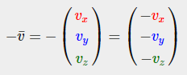
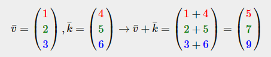
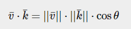
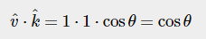
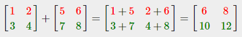
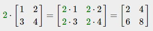
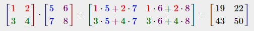
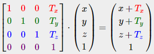
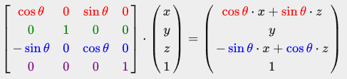
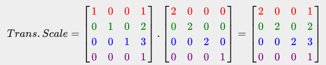

# [Getting Started : Transformations](https://learnopengl.com/Getting-started/Transformations)

우리는 이제 객체를 만드는 방법을 알고 있고, 객체에 색을 입히고/텍스처를 이용하여 자세한 외관을 부여할 수도 있습니다. 그러나 이들은 여전히 정적인 객체들이기 때문에 흥미롭지 않습니다. 우리는 버텍스를 변경하고 프레임마다 버퍼를 재구성함으로써 객체를 움직일 수도 있지만, 이것은 번거롭고 상당한 처리 능력을 요구합니다. 객체를 변형하는 훨씬 더 좋은 방법이 있으며, 바로 (다중) 행렬 객체를 사용하는 것입니다. 이것은 우리가 쿵푸와 거대한 디지털 가상 세계에 대해 이야기하려는 것은 아닙니다.

행렬은 매우 강력한 수학적 개념이며, 처음에는 무서울 수 있지만, 익숙해지면 극도로 유용하다는 것을 알게 될 것입니다. 행렬을 논의할 때, 약간의 수학 지식이 필요하며, 수학적으로 기울어진 독자들을 위해 추가 자료를 참고할 수 있도록 제공하겠습니다.

그러나 변형을 완전히 이해하기 위해 행렬에 대해 논의하기 전에 벡터에 대해 조금 더 깊이 파고들어야 합니다. 이 장의 초점은 나중에 필요로 할 주제에 대해 기본적인 수학적 배경을 제공하는 것입니다. 주제가 어렵다면 최대한 이해하고, 필요할 때 언제든지 이 장으로 돌아와서 개념을 복습해보세요.
<br><br>


## Vectors

가장 기본적인 정의에서 벡터는 방향에 지나지 않습니다. 벡터는 방향과 크기(강도 또는 길이로 알려집니다)를 가지고 있습니다. 벡터를 보물 지도의 방향으로 생각할 수 있습니다: "왼쪽으로 10 보, 이제 북쪽으로 3 보 가고, 오른쪽으로 5 보 가세요"; 여기서 '왼쪽'은 방향이고 '10 보'는 벡터의 크기입니다. 보물 지도의 방향은 이렇게 3개의 벡터로 구성됩니다. 벡터는 어떤 차원이든 가질 수 있지만, 일반적으로 2에서 4차원을 다루는 것이 일반적입니다. 벡터가 2차원이면 평면상의 방향을 나타내고 (2차원 그래프를 생각해보세요), 3차원인 경우 3D 세계에서 어떤 방향이든 나타낼 수 있습니다.

아래에는 각각의 벡터가 2차원 그래프에서 (x, y)로 화살표로 표시된 3개의 벡터가 있습니다. 2차원에서 벡터를 표시하는 것이 (3차원 대신) 직관적이기 때문에, 2차원 벡터를 z 좌표가 0인 3차원 벡터로 생각할 수 있습니다. 벡터는 방향을 나타내므로, 벡터의 원점은 값에 영향을 주지 않습니다. 아래 그래프에서는 $\overrightarrow{v}$ 와 $\overrightarrow{w}$ 라는 벡터가 원점이 다르지만 동일함을 알 수 있습니다.


수학에서 벡터를 설명할 때, 일반적으로 수학자들은 $\overrightarrow{a}$ 와 같이 벡터를 문자 기호 위에 작은 바로 표현하는 것을 선호합니다. 또한, 공식에서 벡터를 표시할 때 일반적으로 다음과 같이 표시됩니다:


벡터는 방향으로 지정되기 때문에 때로는 위치로 시각화하기가 어려울 수 있습니다. 만약 벡터를 위치로 시각화하고 싶다면, 방향 벡터의 원점을 (0,0,0)으로 상상하고, 특정 방향을 가리키도록 지정하여 위치 벡터로 만들 수 있습니다 (또는 다른 원점을 지정하고 "이 벡터는 이 원점으로부터 공간상의 그 점을 가리킵니다"라고 말할 수도 있습니다). 위치 벡터 (3,5)는 따라서 원점이 (0,0)인 그래프에서 (3,5)를 가리킵니다. 벡터를 사용하여 우리는 2차원과 3차원 공간에서 방향과 위치를 설명할 수 있습니다.

일반 숫자와 마찬가지로 벡터에도 여러 연산을 정의할 수 있습니다 (일부는 이미 보았을 것입니다).

### Scalar vector operations

스칼라는 단일 숫자입니다. 벡터와 스칼라를 더하거나 빼거나 곱하거나 나눌 때는 단순히 벡터의 각 요소에 스칼라를 더하거나 빼거나 곱하거나 나누면 됩니다. 덧셈의 경우 다음과 같습니다:


여기서 +는 +, -, ×, ÷와 같은 연산자입니다. 여기서 ×는 곱셈 연산자입니다.

### Vector negation

벡터의 부정은 반대 방향을 가리키는 벡터를 생성합니다. 북동쪽을 가리키는 벡터는 부정 후 남서쪽을 가리키게 됩니다. 벡터를 부정하기 위해 각 구성 요소에 마이너스(-) 부호를 추가합니다 (스칼라 값이 -1인 스칼라-벡터 곱셈으로 나타낼 수도 있습니다):



### Addition and subtraction

두 벡터의 덧셈은 구성 요소별 덧셈으로 정의됩니다. 즉, 한 벡터의 각 구성 요소가 다른 벡터의 해당 구성 요소에 더해집니다. 예시로는 다음과 같습니다:



시각적으로는, 다음과 같이 나타낼 수 있습니다. 벡터 v=(4,2)와 k=(1,2)의 경우, 두 번째 벡터가 첫 번째 벡터의 끝 지점 위에 더해져서 결과 벡터의 끝 지점을 찾습니다 (head-to-tail 방법):


일반적인 덧셈과 뺄셈과 마찬가지로, 벡터의 뺄셈은 두 번째 벡터를 부정한 것과 같습니다. 즉, 두 번째 벡터를 부정한 후에 덧셈을 수행하는 것과 동일합니다:


두 벡터를 서로 빼면 두 벡터가 가리키는 위치의 차이를 나타내는 벡터가 생성됩니다. 이는 두 점 사이의 차이를 나타내는 벡터를 얻어야 하는 특정한 경우에 유용합니다.


### Length

벡터의 길이/크기를 구하기 위해, 수학 수업에서 배운 피타고라스의 정리를 사용합니다. 벡터는 개별적인 x 및 y 성분을 삼각형의 두 변으로 시각화할 때 삼각형을 형성합니다:


두 변의 길이 (x, y)가 알려져 있고, 기울어진 변 $\overrightarrow{v}$의 길이를 알고 싶은 경우, 피타고라스의 정리를 사용하여 다음과 같이 계산할 수 있습니다:


여기서 $\vert \overrightarrow{v} \vert$는 벡터 $\overrightarrow{v}$의 길이를 나타냅니다. 이는 $z^2$를 식에 추가하여 3D로 쉽게 확장할 수 있습니다. 이 경우 벡터 (4, 2)의 길이는 다음과 같습니다:


이 값은 4.47입니다.

또한, 우리가 단위 벡터라고 부르는 특수한 종류의 벡터가 있습니다. 단위 벡터는 길이가 정확히 1인 특징을 갖습니다. 우리는 어떤 벡터로부터 단위 벡터 $\hat{n}$를 계산하기 위해 해당 벡터의 각 구성 요소를 벡터의 길이로 나누는 방식으로 구할 수 있습니다:


이를 벡터를 정규화(normalize)한다고 합니다. 단위 벡터는 머리 위에 작은 첨자를 가지고 표시되며, 일반적으로 작업하기가 더 쉽습니다. 특히, 우리가 방향에만 관심이 있는 경우에 유용합니다 (벡터의 길이를 변경해도 방향은 변하지 않습니다).

### Vector-vector multiplication

두 벡터를 곱하는 것은 약간 이상한 경우입니다. 일반적인 곱셈은 벡터에 대해 정의되어 있지 않으므로 시각적인 의미가 없습니다. 그러나 곱셈을 할 때 선택할 수 있는 두 가지 특수한 경우가 있습니다. 하나는 점곱(dot product)으로 $\overrightarrow{v}⋅\overrightarrow{k}$로 표기되고, 다른 하나는 외적(cross product)으로 $\overrightarrow{v}×\overrightarrow{k}$로 표기됩니다.

### Dot product

두 벡터의 점곱은 각 벡터의 길이의 스칼라 곱에 두 벡터 사이의 각도의 코사인을 곱한 값과 같습니다. 이게 혼동스러울 수 있다면, 해당 공식을 살펴보세요:



여기서 두 벡터 사이의 각도는 세타 (θ)로 나타내어집니다. 이게 왜 흥미로운지 궁금하실 것입니다. $\overrightarrow{v}$와 $\overrightarrow{k}$가 단위 벡터라고 상상해보세요. 그러면 그들의 길이는 1과 같아질 것입니다. 이 경우 공식은 다음과 같이 단순화됩니다:



이제 점곱은 두 벡터 사이의 각도를 정의하는 역할만 합니다. 여러분은 각이 90도일 때 코사인 또는 cos 함수가 0이 되고, 각이 0일 때 1이 되는 것을 기억하실 수 있을 것입니다. 이를 통해 우리는 점곱을 사용하여 두 벡터가 직교하는지 또는 서로 평행한지를 쉽게 확인할 수 있습니다 (직교는 벡터가 서로 직각을 이룸을 의미합니다). sin 함수 또는 cos 함수에 대해 더 알고 싶다면 기본 삼각법에 관한 [Khan Academy 비디오](https://www.khanacademy.org/math/trigonometry/basic-trigonometry/basic_trig_ratios/v/basic-trigonometry)를 추천합니다.

> 두 개의 단위 벡터가 아닌 벡터 사이의 각도를 계산할 수도 있지만, 그러면 결과에서 두 벡터의 길이를 나누어야 cosθ만 남게 됩니다.

그렇다면 어떻게 점곱을 계산할까요? 점곱은 각각의 구성 요소를 곱한 다음 결과를 모두 더하는 것입니다. 다음은 두 개의 단위 벡터로 계산하는 예시입니다 (두 벡터의 길이가 정확히 1임을 확인할 수 있습니다):


두 단위 벡터 사이의 각도를 계산하기 위해 우리는 역코사인 함수$(cos^{−1})$를 사용하고, 이 결과는 143.1도입니다. 이제 이 두 벡터 사이의 각도를 효과적으로 계산했습니다. 점곱은 나중에 조명 계산을 수행할 때 매우 유용합니다.

### Cross product

외적(cross product)은 3D 공간에서만 정의되며, 두 개의 평행이 아닌 벡터를 입력으로 받아 입력 벡터들에 대해 수직인 세 번째 벡터를 생성합니다. 입력 벡터들이 서로 직교하는 경우, 외적은 3개의 직교 벡터를 생성합니다. 이는 이후 장에서 유용하게 사용될 것입니다. 다음 이미지는 3D 공간에서 외적의 모습을 보여줍니다.


다른 연산과 달리, 외적은 선형 대수학을 자세히 알아야 진정으로 이해하기가 어렵기 때문에 공식을 그냥 암기하는 것이 가장 좋습니다. 아래에서 A와 B라는 두 직교 벡터의 외적을 볼 수 있습니다.


보시다시피, 외적은 정말로 이상하게 보일 수 있습니다. 그러나 이러한 단계를 따르면 입력 벡터와 직교하는 다른 벡터를 얻을 수 있습니다.
<br><br>


## Matrices

이제 거의 모든 벡터에 대해 논의했으니 행렬로 넘어가는 시간입니다! 행렬은 숫자, 기호 및/또는 수학 표현식으로 구성된 직사각형 배열입니다. 행렬 내 각 개별 항목을 행렬의 요소라고 합니다. 2x3 행렬의 예시를 아래에 보여드리겠습니다.


행렬은 (i, j)로 색인화됩니다. 여기서 i는 행(row)을, j는 열(column)을 나타냅니다. 이것이 위의 행렬이 2x3 행렬로 불리는 이유입니다(3개의 열과 2개의 행, 행렬의 차원으로 알려져 있기도 합니다). 이는 2차원 그래프를 (x, y)로 색인화하는 것과는 반대입니다. 값 4를 가져오려면 (2, 1)로 색인화합니다(두 번째 행, 첫 번째 열).

행렬은 기본적으로 수학 표현식의 직사각형 배열에 불과합니다. 그러나 행렬은 수학적 성질을 가지며, 벡터와 마찬가지로 여러 가지 연산을 정의할 수 있습니다. 이 연산에는 덧셈, 뺄셈 및 곱셈이 포함됩니다.

### Addition and subtraction

두 개의 행렬 간의 행렬 덧셈과 뺄셈은 각 요소별로 이루어집니다. 따라서 일반적인 숫자에 대해 익숙한 규칙이 적용되지만, 두 행렬의 동일한 인덱스를 가진 요소들끼리 연산이 수행됩니다. 이는 덧셈과 뺄셈이 동일한 차원의 행렬에 대해서만 정의된다는 것을 의미합니다. 3x2 행렬과 2x3 행렬(또는 3x3 행렬과 4x4 행렬)은 함께 더하거나 빼는 것이 불가능합니다. 이제 두 개의 2x2 행렬에 대한 행렬 덧셈이 어떻게 작동하는지 살펴보겠습니다:



행렬 뺄셈에도 동일한 규칙이 적용됩니다:


### Matrix-scalar products

행렬-스칼라 곱은 행렬의 각 요소를 스칼라로 곱합니다. 다음 예시는 곱셈을 보여줍니다:



이제 그 단일 숫자들이 스칼라라고 불리는 이유도 이해됩니다. 스칼라는 기본적으로 행렬의 모든 요소를 해당 값으로 조정합니다. 이전 예시에서는 모든 요소가 2로 스케일되었습니다.

지금까지는 우리의 경우들이 별로 복잡하지 않았습니다. 그것은 행렬-행렬 곱셈에 도전할 때까지입니다.

### Matrix-matrix multiplication

행렬의 곱셈은 반드시 복잡하지는 않지만 익숙해지기 어려운 부분이 있습니다. 행렬 곱셈은 기본적으로 곱셈 시에 미리 정의된 규칙을 따르는 것을 의미합니다. 그러나 몇 가지 제한 사항이 있습니다:

1. 두 개의 행렬을 곱할 수 있는 경우는, 좌측 행렬의 열 수와 우측 행렬의 행 수가 동일한 경우에만 가능합니다.
2. 행렬의 곱셈은 교환 법칙이 성립하지 않습니다. 즉, A⋅B≠B⋅A 입니다.


2개의 2x2 행렬의 행렬 곱셈 예제로 시작해보겠습니다:



지금 당신은 아마 무슨 일이 일어났는지 이해하려고 애를 쓰고 있을 것입니다. 행렬 곱셈은 왼쪽 행렬의 행과 오른쪽 행렬의 열을 사용하여 일반적인 곱셈과 덧셈을 조합하는 것입니다. 다음 이미지를 사용하여 이를 설명해 보겠습니다:


먼저, 우리는 왼쪽 행렬의 윗 행을 선택하고 오른쪽 행렬에서 한 열을 선택합니다. 선택한 행과 열은 결과 2x2 행렬의 어떤 출력 값을 계산할 것인지를 결정합니다. 만약 왼쪽 행렬의 첫 번째 행을 선택한다면, 결과 값은 결과 행렬의 첫 번째 행에 위치하게 됩니다. 그리고 열을 선택하면, 첫 번째 열이라면 결과 값은 결과 행렬의 첫 번째 열에 위치하게 됩니다. 이것이 바로 빨간색 경로의 경우입니다. 우리는 아래쪽 오른쪽 결과를 계산하기 위해 첫 번째 행렬의 아랫 행과 두 번째 행렬의 가장 오른쪽 열을 선택합니다.

결과 값을 계산하기 위해, 우리는 행과 열의 첫 번째 요소를 일반적인 곱셈을 사용하여 곱합니다. 두 번째 요소에 대해서도 동일한 작업을 수행하며, 세 번째, 네 번째 요소 등에 대해서도 동일한 작업을 반복합니다. 각 곱셈의 결과를 합산하면 최종 결과가 됩니다. 이제 왼쪽 행렬의 열의 크기와 오른쪽 행렬의 행의 크기가 동일해야 하는 이유도 이해됩니다. 그렇지 않으면 연산을 완료할 수 없기 때문입니다!

결과는 (n, m) 차원을 가진 행렬입니다. 여기서 n은 좌측 행렬의 행 수와 동일하며, m은 우측 행렬의 열 수와 동일합니다.

만약 머리 속에서 곱셈을 상상하기 어렵다면 걱정하지 마세요. 손으로 계산을 계속 시도하고 어려움이 있을 때마다 이 페이지로 돌아오세요. 시간이 지나면 행렬 곱셈은 당신에게 자연스럽게 다가올 것입니다.

행렬-행렬 곱셈에 대한 논의를 큰 예제로 마무리해 보겠습니다. 색상을 사용하여 패턴을 시각화해 보세요. 유용한 연습으로, 곱셈의 결과와 자체적인 답을 비교해 보세요(행렬 곱셈을 직접 계산해 보면 빠르게 이해하게 될 것입니다).


보시다시피, 행렬-행렬 곱셈은 꽤 번거로운 과정이며 오류가 발생하기 쉽습니다(그래서 우리는 일반적으로 컴퓨터에게 이 작업을 맡깁니다). 그리고 이러한 문제가 행렬이 커지면서 더욱 심각해집니다. 만약 여전히 더 알고 싶고 행렬의 더 많은 수학적 특성에 대해 궁금하다면, [Khan Academy의 행렬에 관한 이 동영상](https://www.khanacademy.org/math/algebra-home/alg-matrices)을 꼭 살펴보기를 강력히 추천합니다.

어쨌든, 이제 우리는 행렬을 곱하는 방법을 알았으므로, 흥미로운 내용으로 넘어갈 수 있습니다.
<br><br>


## Matrix-Vector multiplication

지금까지 벡터에 대해 많이 다뤘습니다. 위치, 색상, 심지어 텍스처 좌표를 나타내는 데에 사용했습니다. 조금 더 깊숙한 곳으로 들어가 보면, 벡터는 기본적으로 N개의 구성 요소를 가진 Nx1 행렬입니다(N차원 벡터로도 알려져 있음). 생각해 보면 많은 의미가 있습니다. 벡터는 행렬과 마찬가지로 숫자들의 배열이지만, 오직 1개의 열만을 가지고 있습니다. 그래서 이 새로운 정보가 우리를 어떻게 도와줄까요? 우리가 MxN 행렬을 가지고 있다면, 우리는 이 행렬을 Nx1 벡터와 곱할 수 있습니다. 왜냐하면 행렬의 열은 벡터의 행 수와 같기 때문에, 행렬 곱셈이 정의되기 때문입니다.

하지만 왜 우리가 행렬을 벡터와 곱할 수 있는지 신경 써야 할까요? 그 이유는 바로 많은 흥미로운 2D/3D 변환을 행렬에 담을 수 있다는 점입니다. 그리고 그 행렬을 벡터와 곱하면 그 벡터가 변환됩니다. 아직 조금 헷갈린다면, 몇 가지 예제를 시작해 보면 곧 무슨 의미인지 알게 될 것입니다.

### Identity matrix

OpenGL에서는 일반적으로 여러 가지 이유로 4x4 변환 행렬을 사용합니다. 그 중 하나는 대부분의 벡터의 크기가 4이기 때문입니다. 가장 간단한 변환 행렬은 항등 행렬입니다. 항등 행렬은 대각선을 제외한 모든 요소가 0인 NxN 행렬입니다. 보시다시피, 이 변환 행렬은 벡터를 완전히 변경하지 않습니다.


해당 벡터는 완전히 변경되지 않습니다. 이는 곱셈의 규칙에서 명백해집니다: 첫 번째 결과 요소는 행렬의 첫 번째 행의 각 요소를 벡터의 각 요소와 곱한 값입니다. 각 행의 요소는 첫 번째 요소를 제외하고는 모두 0이므로 다음과 같이 계산됩니다: 1⋅1+0⋅2+0⋅3+0⋅4=1
이와 같은 계산이 벡터의 다른 3개 요소에도 적용됩니다.

> "변환하지 않는" 변환 행렬의 사용 용도에 대해 궁금할 수 있습니다. 항등 행렬은 일반적으로 다른 변환 행렬을 생성하는 출발점이 되며, 선형 대수학의 더 깊은 내용을 탐구할 경우, 정리를 증명하고 선형 방정식을 해결하는 데 매우 유용한 행렬입니다.

### Scaling

벡터를 스케일링할 때는 방향을 유지한 채로 화살표의 길이를 스케일링하려는 양만큼 증가시킵니다. 2차원 또는 3차원에서 작업하기 때문에, 우리는 각각 하나의 축(x, y 또는 z)을 스케일링하는 2개 또는 3개의 스케일링 변수로 스케일링을 정의할 수 있습니다.

벡터 $\overrightarrow{v} = (3,2)$를 스케일링해 보겠습니다. 우리는 x축을 따라 0.5로 스케일링하여 너비를 절반으로 만들고, y축을 따라 2로 스케일링하여 높이를 두 배로 만들 것입니다. (0.5,2)로 벡터를 스케일링한 결과를 살펴보겠습니다.


OpenGL은 일반적으로 3D 공간에서 작동하기 때문에 이 2D 예제에서는 z축 스케일을 1로 설정하여 그대로 둘 수 있습니다. 방금 수행한 스케일링 작업은 비균일 스케일이며, 각 축에 대해 스케일링 요소가 동일하지 않습니다. 만약 스칼라가 모든 축에서 동일하다면 이를 균일 스케일이라고 부릅니다.

이제 스케일링을 수행하는 변환 행렬을 만들어 봅시다. 항등 행렬에서 각 대각 요소가 해당하는 벡터 요소와 곱해짐을 보았습니다. 만약 항등 행렬의 1을 3으로 변경한다면, 벡터의 각 요소를 3으로 곱하게 되어 벡터를 효과적으로 균일하게 3배 스케일할 수 있습니다. 스케일링 변수를 $(S_1,S_2,S_3)$로 표현한다면, 어떤 벡터 $(x,y,z)$에 대해 스케일링 행렬을 다음과 같이 정의할 수 있습니다:


4번째 스케일링 값인 1을 유지하는 것에 유의하세요. 나중에 알아보게 될 것처럼 w 구성 요소는 다른 목적으로 사용됩니다.

### Translation

변환은 원래 벡터 위에 다른 벡터를 더하여 새로운 위치를 가진 새로운 벡터를 반환하는 과정으로, 이를 통해 변환 벡터를 기반으로 벡터를 이동시킵니다. 벡터의 덧셈에 대해 이미 이야기했으므로 이것은 너무 새로운 내용은 아닐 것입니다.

스케일링 행렬과 마찬가지로 4x4 행렬에서 변환에 사용할 수 있는 여러 위치가 있으며, 이 경우 변환에 사용되는 위치는 4번째 열의 상위 3개 값입니다. 변환 벡터를 $(T_x, T_y, T_z)$로 표현한다면, 변환 행렬을 다음과 같이 정의할 수 있습니다:



이는 모든 변환 값이 벡터의 w 열과 곱해져 벡터의 원래 값에 추가되기 때문에 작동합니다 (행렬 곱셈 규칙을 기억하세요). 이는 3x3 행렬로는 불가능했을 것입니다.


> 동차 좌표 (Homogeneous coordinates)
벡터의 w 구성 요소는 동차 좌표라고도 알려져 있습니다. 동차 벡터로부터 3D 벡터를 얻으려면 x, y 및 z 좌표를 해당 w 좌표로 나눕니다. 보통 w 구성 요소는 대부분 1.0이기 때문에 우리는 이를 눈치채지 못합니다. 동차 좌표를 사용하는 것에는 몇 가지 이점이 있습니다. 3D 벡터에 대한 행렬 변환을 수행할 수 있게 해줍니다 (w 구성 요소가 없으면 벡터를 변환할 수 없음) 그리고 다음 장에서는 w 값을 사용하여 3D 퍼스펙티브를 만듭니다.
또한, 동차 좌표가 0과 같을 때는 벡터가 방향 벡터로 알려져 있습니다. 왜냐하면 w 좌표가 0인 벡터는 변환이 불가능하기 때문입니다.

변환 행렬을 사용하여 우리는 3개의 축 방향 (x, y, z) 중 어느 방향으로든 객체를 이동할 수 있으므로, 이는 우리의 변환 도구 상에서 매우 유용한 변환 행렬입니다.

### Rotation

마지막 몇 가지 변환은 2D 또는 3D 공간에서 비교적 이해하기 쉽고 시각화하기 쉽지만, 회전은 조금 더 복잡합니다. 이러한 행렬이 정확히 어떻게 구성되는지 알고 싶다면 [Khan Academy의 선형 대수학 비디오](https://www.khanacademy.org/math/linear-algebra/matrix-transformations)에서 회전 부분을 시청하는 것을 추천합니다.

먼저, 벡터의 회전이 실제로 무엇인지 정의해 봅시다. 2D 또는 3D에서 회전은 각도로 나타낼 수 있습니다. 각도는 360도 또는 2π 라디안으로 전체 원을 나타낼 수 있습니다. 일반적으로 우리는 각도를 사용하여 회전을 설명하는 것을 선호합니다.

> 대부분의 회전 함수는 라디안 단위의 각도를 요구하지만, 다행히도 간단하게도 각도를 라디안으로 변환할 수 있습니다:  
각도(도) = 각도(라디안) * (180 / PI)  
각도(라디안) = 각도(도) * (PI / 180)  
여기서 PI는 (반올림한) 3.14159265359와 같습니다.

반 원을 회전하면 360/2 = 180도 회전하고, 오른쪽으로 1/5만큼 회전한다는 것은 오른쪽으로 360/5 = 72도 회전한다는 것을 의미합니다. 이것은 기본 2D 벡터에 대해 보여지며, $\overrightarrow{v}$가 $\overrightarrow{k}$로부터 오른쪽으로 72도(시계 방향) 회전합니다.


3D에서의 회전은 각도와 회전 축으로 지정됩니다. 지정된 각도는 주어진 회전 축을 따라 객체를 회전시킵니다. 특정한 각도로 머리를 돌리면서 한 가지 회전 축을 지속적으로 바라보도록 시각화해 보세요. 예를 들어, 3D 세계에서 2D 벡터를 회전시킬 때, 회전 축을 z축으로 설정합니다 (이를 시각화해 보세요).

삼각함수를 사용하여 주어진 각도에 따라 벡터를 새로운 회전된 벡터로 변환하는 것이 가능합니다. 일반적으로 사인 함수와 코사인 함수를 지능적으로 조합하여 이 작업을 수행합니다 (일반적으로 sin과 cos로 줄여서 표기됩니다). 회전 행렬이 생성되는 방식에 대한 논의는 이 장의 범위를 벗어납니다.

회전 행렬은 3D 공간의 각 축에 대해 정의되며, 각도는 세타 기호 θ로 표현됩니다.


X축을 중심으로 한 회전:


Y축을 중심으로 한 회전:



Z축을 중심으로 한 회전:


우리는 회전 행렬을 사용하여 세 개의 단위 축 중 하나를 기준으로 위치 벡터를 변형할 수 있습니다. 임의의 3D 축 주위로 회전하기 위해 우리는 먼저 X축을 기준으로 회전한 다음 Y축, 그리고 Z축을 순서대로 회전시키는 것을 결합할 수 있습니다. 그러나 이는 Gimbal lock이라는 문제를 속속들이 도입하게 됩니다. 자세한 내용은 다루지 않겠지만, 더 좋은 해결책은 회전 행렬을 결합하는 대신 바로 (0.662, 0.2, 0.722)와 같은 임의의 단위 축 주위로 회전하는 것입니다. 이러한 (상세한) 행렬이 존재하며 아래와 같이 주어집니다. 여기서 $(R_x, R_y, R_z)$는 임의의 회전 축을 나타냅니다:


이 장에서는 이러한 행렬을 생성하는 수학적인 논의는 다루지 않습니다.  Gimbal lock을 완전히 방지하기 위해서는 (더 어려워지기는 하지만) 이 행렬만으로는 충분하지 않습니다.  Gimbal lock을 실제로 방지하려면 쿼터니언을 사용하여 회전을 표현해야 합니다. 쿼터니언은 안전하면서도 연산적으로 효율적입니다. 그러나 쿼터니언에 대한 논의는 이 장의 범위를 벗어납니다.

### Combining matrices

행렬을 사용하여 여러 변환을 하나의 행렬로 결합할 수 있다는 것이 변환에 행렬을 사용하는 진정한 힘입니다. 여러 변환을 결합하는 변환 행렬을 생성해 보겠습니다. (x,y,z)라는 벡터를 2배로 확대(scale)하고, 그 다음에 (1,2,3)으로 이동(translate)시키려고 합니다. 필요한 단계별로 이동 행렬과 확대 행렬이 필요합니다. 결과적인 변환 행렬은 다음과 같을 것입니다:



참고로, 행렬 곱셈을 할 때는 먼저 이동(translation) 변환을 수행한 다음에 확대(scale) 변환을 수행합니다. 행렬 곱셈은 교환 법칙(commutative)이 성립하지 않으므로 순서가 중요합니다. 행렬 곱셈을 할 때 가장 오른쪽의 행렬이 먼저 벡터와 곱해지므로 곱셈을 오른쪽에서 왼쪽으로 읽어야 합니다. 행렬을 결합할 때는 일반적으로 확대(scale) 변환을 먼저 수행하고, 그 다음 회전(rotations)을 하고, 마지막으로 이동(translations)을 수행하는 것이 좋습니다. 그렇지 않으면 서로에게 (부정적인) 영향을 줄 수 있습니다. 예를 들어, 먼저 이동을 수행한 다음에 확대를 하면 이동 벡터도 확대되게 됩니다!

최종 변환 행렬을 벡터에 적용하면 다음과 같은 결과 벡터가 나옵니다:


좋아요! 이 벡터는 먼저 2배로 확대(scale)되고, 그런 다음 (1,2,3)으로 이동(translation)합니다.
<br><br>


## In practice

이제 변환에 대한 모든 이론을 설명했으니, 실제로 이 지식을 어떻게 활용할 수 있는지 살펴보는 시간입니다. OpenGL에는 내장된 행렬 또는 벡터 지식이 없으므로 우리는 자체적으로 수학 클래스와 함수를 정의해야 합니다. 이 책에서는 작은 수학적 세부 사항으로부터 추상화하고, 사전에 제작된 수학 라이브러리를 사용하는 것을 선호합니다. 운이 좋게도, GLM이라는 OpenGL에 맞춰진 사용하기 쉬운 수학 라이브러리가 있습니다.

### GLM


GLM은 OpenGL Mathematics의 약자로, 헤더 전용 라이브러리입니다. 이는 적절한 헤더 파일만 포함하면 되므로 링크 및 컴파일 작업이 필요하지 않다는 것을 의미합니다. GLM은 해당 [웹사이트](https://glm.g-truc.net/0.9.8/index.html)에서 다운로드할 수 있습니다. 헤더 파일의 루트 디렉토리를 includes 폴더에 복사하고 시작해봅시다.

GLM의 대부분의 기능은 다음과 같이 포함할 수 있는 3개의 헤더 파일에 포함되어 있습니다:

```
#include <glm/glm.hpp>
#include <glm/gtc/matrix_transform.hpp>
#include <glm/gtc/type_ptr.hpp>
```

이제 glm::vec4로 정의된 (1,0,0) 벡터를 (1,1,0)으로 변환하여 우리의 변환 지식을 실용적으로 활용해 보겠습니다. (참고로, glm::vec4는 그의 동차 좌표를 1.0으로 설정합니다.)

```
glm::vec4 vec(1.0f, 0.0f, 0.0f, 1.0f);
glm::mat4 trans = glm::mat4(1.0f);
trans = glm::translate(trans, glm::vec3(1.0f, 1.0f, 0.0f));
vec = trans * vec;
std::cout << vec.x << vec.y << vec.z << std::endl;
```

먼저 GLM의 내장 벡터 클래스를 사용하여 vec이라는 이름의 벡터를 정의합니다. 다음으로, mat4를 정의하고 대각선 요소를 1.0으로 명시적으로 초기화하여 항등 행렬로 초기화합니다. 항등 행렬로 초기화하지 않으면 행렬은 널 행렬(모든 요소가 0)이 되며, 이후의 모든 행렬 연산도 널 행렬이 됩니다.

다음 단계는 glm::translate 함수에 항등 행렬과 이동 벡터를 함께 전달하여 변환 행렬을 생성하는 것입니다. 이동 행렬과의 곱셈을 통해 주어진 행렬과 결과 행렬이 반환됩니다. 그런 다음 변환 행렬로 벡터를 곱하고 결과를 출력합니다. 여전히 행렬 이동 작업이 어떻게 작동하는지 기억한다면 결과 벡터는 (1+1,0+1,0+0)인 (2,1,0)이어야 합니다. 이 코드 스니펫은 210을 출력하므로 이동 행렬이 정상적으로 작동한 것입니다.

더 흥미로운 작업을 해보기 위해 이전 챕터의 컨테이너 객체를 확대 및 회전시켜 보겠습니다.

```
glm::mat4 trans = glm::mat4(1.0f);
trans = glm::rotate(trans, glm::radians(90.0f), glm::vec3(0.0, 0.0, 1.0));
trans = glm::scale(trans, glm::vec3(0.5, 0.5, 0.5));  
```

먼저, 우리는 컨테이너를 각 축별로 0.5만큼 확대한 다음 Z축을 중심으로 90도 회전시킵니다. GLM은 각도를 라디안 단위로 입력받기 때문에 glm::radians를 사용하여 각도를 라디안으로 변환합니다. 텍스처가 있는 직사각형이 XY 평면에 있다는 점에 유의하세요. 따라서 우리는 Z축을 중심으로 회전시키고자 합니다. 회전하는 축은 단위 벡터이어야 하므로, X, Y, Z축 주위로 회전하지 않는다면 벡터를 정규화해야 합니다. GLM의 각 함수에 행렬을 전달하므로 GLM은 자동으로 행렬을 곱하여 모든 변환을 결합한 변환 행렬을 생성합니다.

다음 큰 질문은 어떻게 변환 행렬을 쉐이더에 전달할까요? 이전에 간단히 언급했듯이 GLSL에도 mat4 타입이 있습니다. 따라서 우리는 버텍스 셰이더를 수정하여 mat4 유니폼 변수를 받아와서 위치 벡터에 해당 행렬을 곱합니다.

```
#version 330 core
layout (location = 0) in vec3 aPos;
layout (location = 1) in vec2 aTexCoord;

out vec2 TexCoord;
  
uniform mat4 transform;

void main()
{
    gl_Position = transform * vec4(aPos, 1.0f);
    TexCoord = vec2(aTexCoord.x, aTexCoord.y);
} 
```

GLSL에는 벡터와 마찬가지로 스위즐링과 비슷한 동작을 수행하는 mat2 및 mat3 타입도 있습니다. 앞서 언급한 스칼라-행렬 곱셈, 행렬-벡터 곱셈 및 행렬-행렬 곱셈과 같은 모든 수학 연산이 행렬 타입에서 허용됩니다. 특별한 행렬 연산이 사용되는 경우에는 무엇이 일어나는지 설명하도록 하겠습니다.

우리는 uniform을 추가하고, 변환 행렬과 위치 벡터를 곱한 후 gl_Position에 전달했습니다. 이제 우리의 컨테이너는 반으로 작아지고 90도 회전되어야 합니다(왼쪽으로 기울어집니다). 하지만 여전히 변환 행렬을 쉐이더에 전달해야 합니다:

```
unsigned int transformLoc = glGetUniformLocation(ourShader.ID, "transform");
glUniformMatrix4fv(transformLoc, 1, GL_FALSE, glm::value_ptr(trans));
```

먼저 우리는 uniform 변수의 위치를 조회한 다음 glUniform을 사용하여 행렬 데이터를 쉐이더로 보냅니다. glUniform의 접미사로는 Matrix4fv가 있습니다. 첫 번째 인자는 이제 익숙한 uniform의 위치입니다. 두 번째 인자는 전송하려는 행렬의 개수인 1입니다. 세 번째 인자는 행렬을 전치(transpose)할지 여부를 묻습니다. OpenGL 개발자들은 일반적으로 열 주요(column-major) 순서라는 내부 행렬 레이아웃을 사용하는데, 이는 GLM의 기본 행렬 레이아웃과 일치하기 때문에 행렬을 전치할 필요가 없습니다. GL_FALSE로 유지할 수 있습니다. 마지막 매개변수는 실제 행렬 데이터인데, GLM은 자체적으로 행렬 데이터를 저장하는 방식이 OpenGL의 기대에 항상 일치하지 않기 때문에 GLM의 내장 함수 value_ptr을 사용하여 데이터를 먼저 변환합니다.

우리는 변환 행렬을 생성하고, 버텍스 쉐이더에서 uniform을 선언하고, 행렬을 쉐이더로 전송하여 버텍스 좌표를 변환했습니다. 결과는 다음과 같아야 합니다:


> 위 출력의 소스 코드는 [여기](../../02.GettingStarted/07.Transformations.01/main.cpp)에서 확인할 수 있습니다.

완벽합니다! 우리의 컨테이너가 실제로 왼쪽으로 기울어져서 두 배로 작아진 것을 확인할 수 있으므로 변환이 성공적이었습니다. 이제 더 흥미로운 변화를 주어 보겠습니다. 컨테이너를 시간이 지남에 따라 회전시키고, 재미로 컨테이너를 창의 오른쪽 하단에 위치시켜 보겠습니다. 컨테이너를 시간이 지남에 따라 회전시키기 위해 변환 행렬을 렌더 루프에서 업데이트해야 합니다. 이는 매 프레임마다 업데이트되어야 하기 때문입니다. GLFW의 시간 함수를 사용하여 시간에 따른 각도를 얻습니다:

```
glm::mat4 trans = glm::mat4(1.0f);
trans = glm::translate(trans, glm::vec3(0.5f, -0.5f, 0.0f));
trans = glm::rotate(trans, (float)glfwGetTime(), glm::vec3(0.0f, 0.0f, 1.0f));
```

이전의 경우와 달리 변환 행렬을 어디에서 선언하든 상관 없지만, 이제는 회전을 계속 업데이트하기 위해 매 반복마다 변환 행렬을 생성해야 합니다. 이는 렌더 루프의 각 반복에서 변환 행렬을 다시 만들어야 함을 의미합니다. 일반적으로 장면을 렌더링할 때마다 여러 변환 행렬을 갖고 있으며, 각 프레임마다 새로운 값으로 재생성됩니다.

여기서는 먼저 컨테이너를 원점(0,0,0)을 기준으로 회전시키고, 회전된 버전을 오른쪽 하단 모서리로 이동시킵니다. 실제로 변환 순서는 반대로 읽어야 함을 기억하세요: 코드에서는 먼저 이동하고 나중에 회전하지만, 실제 변환은 회전을 먼저 적용한 다음에 이동을 수행합니다. 이러한 변환 조합과 객체에 대한 적용 방식을 이해하는 것은 어려울 수 있습니다. 이와 같은 변환을 실험해보면 빠르게 이해할 수 있습니다.

올바르게 작성한 경우 다음과 같은 결과가 나와야 합니다:


여기에 있습니다. 시간에 따라 회전하는 변환 행렬 하나로 완료된 변환된 컨테이너입니다! 그래픽스 분야에서 행렬이 어떻게 강력한 구조인지 알 수 있습니다. 우리는 무한한 수의 변환을 정의하고 이를 모두 하나의 행렬로 결합하여 필요할 때마다 재사용할 수 있습니다. 이와 같은 변환을 정점 셰이더에서 사용하면 정점 데이터를 재정의하는 수고를 덜 수 있으며, 데이터를 계속해서 재전송할 필요도 없으므로 일부 처리 시간을 절약할 수 있습니다(이 과정은 꽤 느립니다). 우리가 해야 할 일은 변환 uniform을 업데이트하는 것뿐입니다.

원하는 결과를 얻지 못했거나 다른 어려움에 봉착한 경우 [소스 코드](../../02.GettingStarted/07.Transformations.02/main.cpp)와 업데이트된 [셰이더 클래스](../../02.GettingStarted/07.Transformations.02/Shader.h)를 살펴보세요.

다음 장에서는 행렬을 사용하여 정점의 다른 좌표 공간을 정의하는 방법에 대해 논의합니다. 이는 3D 그래픽스로의 첫 걸음이 될 것입니다!

### Further reading

- [Essence of Linear Algebra](https://www.youtube.com/playlist?list=PLZHQObOWTQDPD3MizzM2xVFitgF8hE_ab): 그랜트 샌더슨(Grant Sanderson)에 의한 변환과 선형 대수학의 근본적인 수학에 관한 훌륭한 비디오 강의 시리즈입니다.