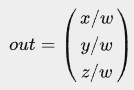
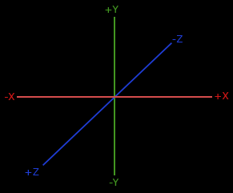

# [Getting Started : Coordinate Systems](https://learnopengl.com/Getting-started/Coordinate-Systems)

지난 장에서는 변환 행렬을 사용하여 모든 정점을 변형하여 행렬을 우리의 이점으로 삼을 수 있는 방법을 배웠습니다. OpenGL은 각 정점 쉐이더 실행 후에 보이기를 원하는 모든 정점이 정규화된 장치 좌표에 있어야 한다고 예상합니다. 즉, 각 정점의 x, y 및 z 좌표는 -1.0과 1.0 사이여야 하며, 이 범위를 벗어나는 좌표는 보이지 않습니다. 보통 우리는 좌표를 우리가 정한 범위(또는 공간)에 지정하고, 정점 쉐이더에서 이러한 좌표를 정규화된 장치 좌표(NDC)로 변환합니다. 이러한 NDC는 이후 래스터라이저에게 주어져 화면의 2D 좌표/픽셀로 변환됩니다.

좌표를 NDC로 변환하는 것은 일반적으로 단계적인 방식으로 이루어지며, 객체의 정점을 최종적으로 NDC로 변환하기 전에 여러 좌표 시스템으로 변환합니다. 여러 중간 좌표 시스템으로 변환하는 장점은 특정 좌표 시스템에서 일부 연산/계산이 더 쉬울 수 있다는 점입니다. 우리에게 중요한 총 5개의 서로 다른 좌표 시스템이 있습니다:

- 로컬 공간(또는 개체 공간)
- 월드 공간
- 뷰 공간(또는 시선 공간)
- 클립 공간
- 스크린 공간

이것들은 우리의 정점들이 최종적으로 프래그먼트로 끝나기 전에 변환되는 서로 다른 상태입니다.

아마도 지금쯤이면 공간이나 좌표 시스템이 실제로 무엇인지에 대해 상당히 혼란스러울 것입니다. 그러므로 우리는 각 특정 공간이 어떤 것을 나타내는지 전체적인 그림을 먼저 고려하여 좀 더 고수준으로 설명하겠습니다.
<br><br>


## The global picture

한 공간에서 다음 좌표 공간으로 좌표를 변환하기 위해 모델, 뷰 및 투영 행렬을 포함한 여러 변환 행렬을 사용합니다. 우리의 정점 좌표는 먼저 로컬 공간에서 로컬 좌표로 시작하고, 이후 월드 좌표, 뷰 좌표, 클립 좌표로 계속 처리되며, 최종적으로 스크린 좌표로 끝납니다. 다음 이미지는 이 과정을 보여주고 각 변환의 역할을 보여줍니다:


1. 로컬 좌표는 개체의 로컬 원점을 기준으로 한 개체의 좌표입니다. 개체가 시작하는 좌표입니다.

2. 다음 단계는 로컬 좌표를 월드 공간 좌표로 변환하는 것입니다. 이 좌표는 큰 세계에 대한 좌표입니다. 이 좌표는 세계의 전역 원점과 함께 상대적으로 배치된 다른 많은 개체에 대한 좌표입니다.

3. 그 다음으로 월드 좌표를 뷰 공간 좌표로 변환합니다. 각 좌표는 카메라 또는 뷰어의 시점에서 본 것처럼 표시됩니다.

4. 좌표가 뷰 공간에 있으면 클립 좌표로 투영하고자 합니다. 클립 좌표는 -1.0과 1.0 범위로 처리되며, 어떤 정점이 화면에 나타날지 결정합니다. 투영 변환을 사용할 경우 원근감을 추가할 수 있습니다.

5. 마지막으로 클립 좌표를 스크린 좌표로 변환하는데, 이 과정을 뷰포트 변환(viewport transform)이라고 합니다. 이 변환은 좌표를 -1.0과 1.0에서 glViewport로 정의된 좌표 범위로 변환합니다. 변환된 좌표는 래스터라이저로 전달되어 프래그먼트로 변환됩니다.

아마도 각 개별 공간이 어떤 용도로 사용되는지에 대해 어느 정도 감이 오셨을 것입니다. 정점을 이러한 다양한 공간으로 변환하는 이유는 특정 좌표 시스템에서 일부 연산이 더 의미 있거나 더 쉽기 때문입니다. 예를 들어, 개체를 수정할 때는 로컬 공간에서 이 작업을 수행하는 것이 가장 의미가 있지만, 다른 개체의 위치에 따라 개체에 대한 특정 연산을 계산하는 경우 월드 좌표에서 이를 수행하는 것이 가장 의미가 있습니다. 우리는 원한다면 로컬 공간에서 클립 공간으로 한 번에 변환하는 하나의 변환 행렬을 정의할 수 있지만, 그렇게 하면 유연성이 떨어집니다.

아래에서 각 좌표 시스템을 더 자세히 설명하겠습니다.

### Local space

로컬 공간은 개체에 로컬한 좌표 공간으로, 개체가 시작하는 곳입니다. 예를 들어, Blender와 같은 모델링 소프트웨어에서 큐브를 생성한 경우를 상상해보세요. 큐브의 원점은 아마도 (0, 0, 0)에 위치할 것입니다. 하지만 최종 응용 프로그램에서 큐브는 다른 위치에 놓일 수도 있습니다. 아마도 생성한 모든 모델의 초기 위치는 (0, 0, 0)일 것입니다. 모델의 모든 정점은 따라서 로컬 공간에 있습니다: 모두 개체에 로컬한 좌표를 가지고 있습니다.

저희가 사용한 컨테이너의 정점들은 -0.5부터 0.5까지의 좌표로 지정되었으며, 원점은 0.0입니다. 이들은 로컬 좌표입니다.

### World space

만약 모든 개체를 응용 프로그램에 직접 가져온다면, 그들은 아마도 모두 세상의 원점인 (0, 0, 0)에 위치해 있을 것입니다. 이는 우리가 원하는 것이 아닙니다. 우리는 각 개체를 큰 세계 내에서 위치시키기 위해 개체마다 위치를 정의하고자 합니다. 월드 공간의 좌표는 그들이 속한 (게임) 세계에 대한 좌표입니다. 이는 개체가 흩어져 있는 공간으로 변환되는 좌표 공간입니다(가능한한 현실적인 방식으로). 개체의 좌표는 로컬 공간에서 월드 공간으로 변환됩니다. 이는 모델 행렬을 사용하여 수행됩니다.

모델 행렬은 개체를 변환하여 월드 내에서 해당 위치/방향에 놓는 변환 행렬입니다. 예를 들어, 집을 변환한다고 생각해보세요. 로컬 공간에서 크기를 축소하고(로컬 공간에서 다소 크기가 컸습니다), 교외 도시로 이동하고, 인접한 집과 잘 어울리도록 y축을 기준으로 왼쪽으로 약간 회전시킵니다. 이전 장에서 컨테이너를 장면의 다양한 위치에 배치하기 위해 사용한 행렬을 모델 행렬의 일종으로 생각할 수도 있습니다. 우리는 컨테이너의 로컬 좌표를 장면/월드의 다른 장소로 변환했습니다.

### View space

뷰 공간은 사람들이 일반적으로 OpenGL의 카메라라고 부르는 것입니다(때로는 카메라 공간이나 시점 공간이라고도 알려져 있습니다). 뷰 공간은 월드 공간 좌표를 사용자의 시야 앞에 있는 좌표로 변환한 결과입니다. 뷰 공간은 따라서 카메라의 시점에서 본 공간입니다. 이는 일반적으로 일부 항목이 카메라 앞으로 변환되도록 장면을 이동하고 회전하는 번역 및 회전의 조합으로 수행됩니다. 이러한 복합 변환은 일반적으로 월드 좌표를 뷰 공간으로 변환하는 뷰 행렬(view matrix)에 저장됩니다. 다음 장에서는 이러한 뷰 행렬을 생성하여 카메라를 모방하는 방법에 대해 상세히 다룰 것입니다.

### Clip space

각 정점 쉐이더 실행의 끝에서 OpenGL은 좌표가 특정 범위 내에 있어야 하며, 이 범위를 벗어나는 좌표는 클리핑됩니다. 클리핑된 좌표는 폐기되므로 남은 좌표는 화면에서 보이는 프래그먼트로 표시됩니다. 이것이 클리핑 공간이라는 이름을 얻는 곳입니다.

-1.0과 1.0 사이의 모든 보이는 좌표를 지정하는 것이 직관적이지 않기 때문에, 우리는 작업할 좌표 세트를 지정하고 OpenGL이 기대하는 대로 다시 NDC로 변환합니다.

뷰 좌표에서 클립 공간으로 정점 좌표를 변환하기 위해 우리는 프로젝션 행렬이라고 불리는 행렬을 정의합니다. 이 행렬은 각 차원에서 -1000과 1000과 같은 좌표 범위를 지정합니다. 그런 다음, 프로젝션 행렬은 지정된 범위 내의 좌표를 정규화 장치 좌표(-1.0, 1.0)로 변환합니다(직접적으로 변환되지 않고, 사이에 퍼스펙티브 분할이라는 단계가 있습니다). 이 범위를 벗어나는 모든 좌표는 -1.0과 1.0 사이로 매핑되지 않으며, 따라서 클리핑됩니다. 우리가 프로젝션 행렬에서 지정한 이 범위로는 (1250, 500, 750)와 같은 좌표는 보이지 않을 것입니다. x 좌표가 범위를 벗어나기 때문에 이 좌표는 NDC에서 1.0보다 큰 좌표로 변환되고, 따라서 클리핑됩니다.

> 참고로, 만약 삼각형과 같은 원시(primitive)의 일부분만 클리핑 볼륨 밖에 있다면 OpenGL은 삼각형을 하나 이상의 삼각형으로 재구성하여 클리핑 범위 내에 맞게 조정합니다.

프로젝션 행렬이 만드는 이 보이는 상자는 투시뿐만 아니라 트랩프러스텀(trapfrustum)이라고도 합니다. 이 트랩프러스텀 안에 들어오는 각 좌표는 사용자의 화면에 나타납니다. 지정된 범위 내의 좌표를 2D 뷰 공간 좌표로 쉽게 매핑할 수 있는 NDC로 변환하는 전체 과정은 투영(projection)이라고 합니다. 왜냐하면 투영 행렬이 3D 좌표를 쉽게 매핑할 수 있는 2D 정규화 장치 좌표로 투영하기 때문입니다.

정점이 클리핑 공간으로 변환되면 최종적으로 원근 나눗셈(perspective division)이라는 작업이 수행됩니다. 여기서 위치 벡터의 x, y 및 z 구성 요소를 벡터의 동차적인 w 구성 요소로 나누게 됩니다. 원근 나눗셈은 4D 클리핑 공간 좌표를 3D 정규화 장치 좌표로 변환합니다. 이 단계는 정점 쉐이더 단계의 끝에서 자동으로 수행됩니다.

이 단계 이후에는 결과 좌표가 화면 좌표로 매핑되고(glViewport 설정을 사용하여), 그리고 프래그먼트로 변환됩니다.

뷰 좌표를 클립 좌표로 변환하기 위한 프로젝션 행렬은 일반적으로 두 가지 다른 형태를 취하며, 각 형태는 고유한 프러스텀(frustum)을 정의합니다. 우리는 직교 투영 행렬(orthographic projection matrix) 또는 원근 투영 행렬(perspective projection matrix)을 생성할 수 있습니다.

### 직교 투영 Orthographic projection

직교 투영 행렬은 클리핑 공간을 정의하는 큐브 모양의 프러스텀 상자를 정의합니다. 이 상자 밖의 각 정점은 클리핑됩니다. 직교 투영 행렬을 생성할 때는 보이는 프러스텀의 너비, 높이 및 길이를 지정합니다. 이 프러스텀 내의 모든 좌표는 해당 행렬에 의해 변환된 후 NDC 범위 내에 있게 되므로 클리핑되지 않습니다. 프러스텀은 약간 컨테이너와 같은 모양을 가지고 있습니다:


프러스텀은 보이는 좌표를 정의하며, 너비, 높이, 그리고 가까운 평면과 먼 평면으로 지정됩니다. 가까운 평면 앞에 있는 모든 좌표는 클리핑되며, 먼 평면 뒤에 있는 좌표에도 동일하게 적용됩니다. 직교 투영 프러스텀은 변환된 벡터의 w 구성 요소에 영향을 주지 않기 때문에, 프러스텀 내의 모든 좌표를 특별한 부작용 없이 정규화된 장치 좌표로 직접 매핑합니다. 만약 w 구성 요소가 1.0과 같은 값을 유지한다면 원근 나눗셈은 좌표를 변경하지 않습니다.

직교 투영 행렬을 생성하기 위해 GLM의 내장 함수 glm::ortho를 사용합니다.

```
glm::ortho(0.0f, 800.0f, 0.0f, 600.0f, 0.1f, 100.0f);
```

첫 번째 두 매개변수는 프러스텀의 왼쪽과 오른쪽 좌표를 지정하고, 세 번째와 네 번째 매개변수는 프러스텀의 아래쪽과 위쪽 부분을 지정합니다. 이렇게 4개의 점으로 가까운 평면과 먼 평면의 크기를 정의하고, 다섯 번째와 여섯 번째 매개변수는 가까운 평면과 먼 평면 사이의 거리를 정의합니다. 이 특정한 직교 투영 행렬은 이 x, y 및 z 범위 값 사이의 모든 좌표를 정규화된 장치 좌표로 변환합니다.

직교 투영 행렬은 좌표를 화면인 2D 평면에 직접 매핑하지만, 실제로는 직접 투영을 사용하면 원근감을 고려하지 않아 실감나지 않은 결과가 생성됩니다. 이를 해결하기 위해 원근 투영 행렬이 필요합니다.

### 원근 투영 perspective projection

만약 실제 생활에서 그래픽을 즐긴다면 먼 거리에 있는 물체가 훨씬 작게 보인다는 것을 알아차릴 것입니다. 이 이상한 현상을 우리는 원근감이라고 합니다. 원근감은 무한한 고속도로나 철도 끝을 바라볼 때 특히 두드러지게 나타납니다. 다음 이미지에서 확인할 수 있습니다.


보시다시피, 원근감으로 인해 선들이 충분히 먼 거리에서 일치하는 것처럼 보입니다. 이것이 바로 원근 투영이 모방하려는 효과이며, 원근 투영은 원근 투영 행렬을 사용하여 이를 구현합니다. 원근 투영 행렬은 주어진 프러스텀 범위를 클립 공간에 매핑하지만, 또한 각 정점 좌표의 w 값을 조작하여 뷰어로부터 멀어질수록 이 w 구성 요소가 더 높아지도록 합니다. 좌표가 클립 공간으로 변환되면 -w에서 w까지의 범위에 있게 됩니다 (이 범위를 벗어나는 것은 클리핑됩니다). OpenGL은 최종적으로 정점 셰이더 출력으로 -1.0과 1.0 사이의 가시 좌표를 요구하므로, 좌표가 클립 공간에 있으면 원근 분할이 클립 공간 좌표에 적용됩니다.



각 정점 좌표의 각 구성 요소는 해당 w 구성 요소로 나누어지며, 뷰어로부터 정점이 더 멀어질수록 작아집니다. 이것은 왜 w 구성 요소가 중요한지 또 다른 이유이며, 원근 투영에 도움이 됩니다. 결과 좌표는 정규화된 장치 공간에 있게 됩니다. 만약 실제로 직교 및 원근 투영 행렬이 어떻게 계산되는지 알고 싶고 (그리고 수학에 두려움이 없다면), [Songho의 이 훌륭한 글](http://www.songho.ca/opengl/gl_projectionmatrix.html)을 추천합니다.

다음과 같이 GLM에서 원근 투영 행렬을 생성할 수 있습니다:

```
glm::mat4 proj = glm::perspective(glm::radians(45.0f), (float)width/(float)height, 0.1f, 100.0f);
```

glm::perspective는 다시 한 번 보이는 공간을 정의하는 큰 원근 투영 뚜껑을 만듭니다. 뚜껑 바깥에 있는 것은 클립 공간 볼륨에 들어가지 않으며 따라서 클리핑됩니다. 원근 투영 뚜껑은 비균일하게 형성된 상자로 시각화될 수 있으며, 이 상자 안의 각 좌표는 클립 공간의 한 점에 매핑됩니다. 아래에 원근 투영 뚜껑의 이미지가 표시되어 있습니다.


첫 번째 매개변수는 시야각을 나타내는 fov(시야각) 값을 정의하며, 뷰 스페이스의 크기를 설정합니다. 실제적인 시각을 위해 일반적으로 45도로 설정하지만, 더 둠 스타일의 결과를 얻으려면 더 높은 값으로 설정할 수도 있습니다. 두 번째 매개변수는 종횡비(aspect ratio)를 설정하는데, 이는 뷰포트의 너비를 높이로 나눈 값입니다. 세 번째와 네 번째 매개변수는 원근 투영 뚜껑의 가까운 면과 먼 면을 설정합니다. 일반적으로 가까운 거리는 0.1로 설정하고, 먼 거리는 100.0으로 설정합니다. 원근 투영 뚜껑 내부에 있는 가까운 면과 먼 면 사이의 모든 정점이 렌더링됩니다.

> 원근 투영 행렬의 가까운 값이 너무 높게 설정되면(예: 10.0), OpenGL은 카메라에 가까운 좌표(0.0과 10.0 사이)를 클리핑하게 되는데, 이는 비디오 게임에서 일부 개체를 너무 가까이 접근할 때 특정 개체를 통해 볼 수 있는 시각적인 결과를 얻을 수 있습니다.

직교 투영(orthographic projection)을 사용할 때는 각 정점 좌표가 원근 투영과는 달리 고급 원근 투영이 없이 직접적으로 클립 스페이스에 매핑됩니다(w 성분은 여전히 원래대로 1로 유지되므로 영향을 주지 않음). 직교 투영은 원근 투영을 사용하지 않기 때문에 먼 거리의 개체가 작아 보이지 않아 이상한 시각적인 결과물이 생성됩니다. 이러한 이유로 직교 투영은 주로 2D 렌더링 및 일부 건축 및 공학 응용 프로그램에서 원근에 의해 정점이 왜곡되지 않는 것이 바람직한 경우에 사용됩니다. 3D 모델링에 사용되는 Blender와 같은 응용 프로그램에서는 종종 개체의 크기를 더 정확하게 나타내기 위해 직교 투영을 사용합니다. 아래에는 Blender에서 두 투영 방법을 비교한 이미지가 있습니다.


원근 투영을 사용하는 경우, 더 멀리 있는 정점들이 훨씬 작아 보이는 반면, 직교 투영에서는 각 정점이 사용자와 동일한 거리에 있습니다.

### Putting it all together


우리는 앞서 언급한 세 가지 단계에 대해 각각 변환 행렬을 생성합니다: 모델, 뷰, 그리고 투영 행렬입니다. 그런 다음 정점 좌표는 다음과 같이 클립 좌표로 변환됩니다:

$V_{clip} = M_{projection} * M_{view} * M_{model} * M_{local}$

주의해야 할 점은 행렬 곱셈의 순서가 반대로 되어 있다는 것입니다 (행렬 곱셈은 오른쪽에서 왼쪽으로 읽어야 함을 기억하세요). 그 결과로 나온 정점은 정점 셰이더에서 gl_Position에 할당되며, OpenGL은 자동으로 투영 분할과 클리핑을 수행합니다.

> 그리고 무엇이 일어날까요?  
정점 셰이더의 출력은 변환 행렬을 사용하여 클립 공간에 좌표가 있어야 합니다. 우리는 방금 그것을 수행했습니다. 그런 다음 OpenGL은 클립 공간 좌표에 대해 투영 분할을 수행하여 정규화된 장치 좌표로 변환합니다. 그런 다음 OpenGL은 glViewPort의 매개변수를 사용하여 정규화된 장치 좌표를 화면 좌표로 매핑합니다. 각 좌표는 화면의 한 점에 해당합니다 (우리의 경우 800x600 화면). 이 과정을 뷰포트 변환이라고 합니다.

이것은 이해하기 어려운 주제이므로 각 공간이 실제로 어떻게 사용되는지 정확히 이해하지 못하더라도 걱정하지 않아도 됩니다. 아래에서는 이러한 좌표 공간을 실제로 어떻게 활용할 수 있는지 보여주며, 다음 장에서는 충분한 예제가 제시될 것입니다.
<br><br>


## Going 3D

지금까지 2D 평면을 보여주기만 했던 것 대신에 3D 좌표를 2D 좌표로 변환하는 방법을 알게 되었으므로 이제 진짜 3D 객체를 렌더링할 수 있습니다.

3D로 그리기 시작하기 위해 먼저 모델 행렬을 생성합니다. 모델 행렬은 전역 월드 공간에 객체의 정점을 변환하기 위해 적용할 이동, 스케일링 및/또는 회전으로 구성됩니다. 우리는 우리의 평면을 약간 변형시켜 x축을 기준으로 회전시켜 바닥에 누워 있는 것처럼 보이게 해보겠습니다. 그러면 모델 행렬은 다음과 같습니다:

```
glm::mat4 model = glm::mat4(1.0f);
model = glm::rotate(model, glm::radians(-55.0f), glm::vec3(1.0f, 0.0f, 0.0f)); 
```

이 모델 행렬과 정점 좌표를 곱함으로써 정점 좌표를 월드 좌표로 변환합니다. 우리의 바닥에 약간 접한 평면은 따라서 전역 월드에서의 평면을 나타냅니다.

다음으로 뷰 행렬을 생성해야 합니다. 우리는 장면에서 약간 뒤로 물러나서 객체가 보이도록 하려고 합니다 (월드 공간에서는 원점(0,0,0)에 위치합니다). 장면 주위를 움직이기 위해서는 다음을 고려해보세요:

- 카메라를 뒤로 움직이는 것은 전체 장면을 앞으로 이동시키는 것과 동일합니다.

이것이 바로 뷰 행렬이 하는 일입니다. 원하는 카메라의 이동 위치의 반대로 전체 장면을 이동시킵니다.
우리가 뒤로 이동하려고 하고 OpenGL은 오른손 좌표계이기 때문에 양의 z축으로 이동해야 합니다. 이를 위해 장면을 음의 z축 방향으로 이동시킵니다. 이렇게 하면 우리가 뒤로 이동하는 것처럼 느껴집니다.

Right-handed system

약속상 OpenGL은 오른손 좌표계입니다. 이는 기본적으로 양의 x축이 오른쪽, 양의 y축이 위쪽, 양의 z축이 뒤쪽을 가리킨다는 것을 의미합니다. 화면을 3개의 축의 중심으로 생각하고 양의 z축이 화면을 통해 사용자에게로 향하도록 합니다. 축은 다음과 같이 그려집니다:



오른손 좌표계가 왜 그렇게 불리는지 이해하기 위해 다음을 따라해 보세요:

- 오른쪽 팔을 양의 y축을 따라 위로 뻗어 보세요.
- 엄지손가락을 오른쪽으로 향하도록 해주세요.
- 겨드랑이 손가락을 위쪽으로 향하도록 해주세요.
- 이제 중지 손가락을 90도 내립니다.

잘 따라했다면, 엄지손가락은 양의 x축을 가리키게 될 것이고, 겨드랑이 손가락은 양의 y축을 가리키게 될 것이며, 중지 손가락은 양의 z축을 가리키게 될 것입니다. 이를 왼팔로 하게 되면 z축이 반대로 향하는 것을 알 수 있습니다. 이를 왼손 좌표계라고 하며 DirectX에서 일반적으로 사용됩니다. 정규화된 장치 좌표계에서 OpenGL은 실제로 왼손 좌표계를 사용합니다 (투영 행렬에서 좌우가 바뀝니다).


다음 장에서는 장면 내에서 이동하는 방법에 대해 더 자세히 다루겠습니다. 현재로서는 view 행렬은 다음과 같습니다:

```
glm::mat4 view = glm::mat4(1.0f);
// note that we're translating the scene in the reverse direction of where we want to move
view = glm::translate(view, glm::vec3(0.0f, 0.0f, -3.0f)); 
```

마지막으로 정의해야 할 것은 투영 행렬입니다. 장면에 퍼스펙티브 투영을 사용하려고 하므로 투영 행렬은 다음과 같이 선언합니다:

```
glm::mat4 projection;
projection = glm::perspective(glm::radians(45.0f), 800.0f / 600.0f, 0.1f, 100.0f);
```

변환 행렬을 생성했으므로 이제 셰이더에 전달해야 합니다. 먼저 변환 행렬을 버텍스 셰이더의 유니폼으로 선언하고 버텍스 좌표와 곱합니다:

```
#version 330 core
layout (location = 0) in vec3 aPos;
...
uniform mat4 model;
uniform mat4 view;
uniform mat4 projection;

void main()
{
    // note that we read the multiplication from right to left
    gl_Position = projection * view * model * vec4(aPos, 1.0);
    ...
}
```

우리는 또한 매 프레임마다 (변환 행렬이 자주 변경되기 때문에) 셰이더로 행렬을 전송해야 합니다:

```
int modelLoc = glGetUniformLocation(ourShader.ID, "model");
glUniformMatrix4fv(modelLoc, 1, GL_FALSE, glm::value_ptr(model));
... // same for View Matrix and Projection Matrix
```

이제 모델, 뷰 및 투영 행렬을 통해 버텍스 좌표가 변환되었으므로 최종 객체는 다음과 같아야 합니다:

- 뒤로 기울어진다.
- 우리로부터 조금 멀어진다.
- 퍼스펙티브로 표시된다 (정점이 더 멀어질수록 작아져야 한다).

결과가 이러한 요구 사항을 충족하는지 확인해 보겠습니다.


실제로 비행기가 상상의 땅에 놓인 3D 평면처럼 보입니다. 같은 결과를 얻지 못하는 경우 코드를 완전한 [소스 코드](../../02.GettingStarted/08.CoordinateSystems.01/main.cpp)와 비교해보세요.

### More 3D

지금까지 우리는 3D 공간에서도 2D 평면으로 작업을 해왔으므로, 모험적인 길을 선택하여 2D 평면을 3D 큐브로 확장해보겠습니다. 큐브를 렌더링하기 위해서는 총 36개의 정점이 필요합니다 (6면 * 2삼각형 * 3정점). 36개의 정점을 모두 더하는 것은 귀찮을 수 있으므로, 아래에서 정점들을 가져올 수 있습니다.

```
float vertices[] = {
    -0.5f, -0.5f, -0.5f,  0.0f, 0.0f,
     0.5f, -0.5f, -0.5f,  1.0f, 0.0f,
     0.5f,  0.5f, -0.5f,  1.0f, 1.0f,
     0.5f,  0.5f, -0.5f,  1.0f, 1.0f,
    -0.5f,  0.5f, -0.5f,  0.0f, 1.0f,
    -0.5f, -0.5f, -0.5f,  0.0f, 0.0f,

    -0.5f, -0.5f,  0.5f,  0.0f, 0.0f,
     0.5f, -0.5f,  0.5f,  1.0f, 0.0f,
     0.5f,  0.5f,  0.5f,  1.0f, 1.0f,
     0.5f,  0.5f,  0.5f,  1.0f, 1.0f,
    -0.5f,  0.5f,  0.5f,  0.0f, 1.0f,
    -0.5f, -0.5f,  0.5f,  0.0f, 0.0f,

    -0.5f,  0.5f,  0.5f,  1.0f, 0.0f,
    -0.5f,  0.5f, -0.5f,  1.0f, 1.0f,
    -0.5f, -0.5f, -0.5f,  0.0f, 1.0f,
    -0.5f, -0.5f, -0.5f,  0.0f, 1.0f,
    -0.5f, -0.5f,  0.5f,  0.0f, 0.0f,
    -0.5f,  0.5f,  0.5f,  1.0f, 0.0f,

     0.5f,  0.5f,  0.5f,  1.0f, 0.0f,
     0.5f,  0.5f, -0.5f,  1.0f, 1.0f,
     0.5f, -0.5f, -0.5f,  0.0f, 1.0f,
     0.5f, -0.5f, -0.5f,  0.0f, 1.0f,
     0.5f, -0.5f,  0.5f,  0.0f, 0.0f,
     0.5f,  0.5f,  0.5f,  1.0f, 0.0f,

    -0.5f, -0.5f, -0.5f,  0.0f, 1.0f,
     0.5f, -0.5f, -0.5f,  1.0f, 1.0f,
     0.5f, -0.5f,  0.5f,  1.0f, 0.0f,
     0.5f, -0.5f,  0.5f,  1.0f, 0.0f,
    -0.5f, -0.5f,  0.5f,  0.0f, 0.0f,
    -0.5f, -0.5f, -0.5f,  0.0f, 1.0f,

    -0.5f,  0.5f, -0.5f,  0.0f, 1.0f,
     0.5f,  0.5f, -0.5f,  1.0f, 1.0f,
     0.5f,  0.5f,  0.5f,  1.0f, 0.0f,
     0.5f,  0.5f,  0.5f,  1.0f, 0.0f,
    -0.5f,  0.5f,  0.5f,  0.0f, 0.0f,
    -0.5f,  0.5f, -0.5f,  0.0f, 1.0f
};
```

재미를 위해 시간이 지남에 따라 큐브를 회전시켜보겠습니다:

```
model = glm::rotate(model, (float)glfwGetTime() * glm::radians(50.0f), glm::vec3(0.5f, 1.0f, 0.0f));
```

그런 다음 우리는 glDrawArrays를 사용하여 큐브를 그릴 것입니다 (인덱스를 지정하지 않았으므로), 하지만 이번에는 정점 개수를 36으로 설정합니다.

```
glDrawArrays(GL_TRIANGLES, 0, 36);
```

다음과 비슷한 결과를 얻어야 합니다:


> 위 출력의 소스 코드는 [여기](../../02.GettingStarted/08.CoordinateSystems.02/main.cpp)에서 확인할 수 있습니다.

약간의 큐브 모양은 비슷하지만 무언가가 잘못된 것 같습니다. 큐브의 일부 면이 다른 면 위에 그려지고 있습니다. 이는 OpenGL이 큐브를 삼각형별로, 프래그먼트별로 그릴 때 이미 그려진 픽셀 색상을 덮어쓰기 때문에 발생합니다. OpenGL은 동일한 드로우 호출 내에서 렌더링되는 삼각형의 순서에 대해 보장을 제공하지 않으므로, 한 삼각형이 명확히 다른 삼각형 앞에 있어야 할지라도 서로 겹쳐서 그려집니다.

다행히도, OpenGL은 z-버퍼라는 버퍼에 깊이 정보를 저장하여 픽셀을 그릴 때 언제 그리고 언제 그리지 않을지를 결정할 수 있습니다. 우리는 z-버퍼를 사용하여 OpenGL을 깊이 테스팅을 수행하도록 구성할 수 있습니다.

### Z-buffer

OpenGL은 모든 깊이 정보를 z-버퍼 또는 깊이 버퍼라고도 하는 버퍼에 저장합니다. GLFW는 이러한 버퍼를 자동으로 생성합니다 (출력 이미지의 색상을 저장하는 컬러 버퍼와 마찬가지로). 깊이는 각 프래그먼트 내에 저장되며, 프래그먼트가 색상을 출력하려고 할 때 OpenGL은 해당 프래그먼트의 깊이 값을 z-버퍼의 값과 비교합니다. 현재 프래그먼트가 다른 프래그먼트 뒤에 있는 경우 해당 프래그먼트는 폐기되고 그렇지 않은 경우 덮어씌워집니다. 이 과정을 깊이 테스팅(depth testing)이라고 하며, OpenGL에서 자동으로 수행됩니다.

그러나 OpenGL이 실제로 깊이 테스팅을 수행하도록 하려면 먼저 OpenGL에게 깊이 테스팅을 활성화하려는 의사를 전달해야 합니다. 기본적으로 깊이 테스팅은 비활성화되어 있습니다. glEnable를 사용하여 깊이 테스팅을 활성화할 수 있습니다. glEnable 및 glDisable 함수를 사용하면 OpenGL에서 특정 기능을 활성화하거나 비활성화할 수 있습니다. 그러한 기능은 해당 기능을 비활성화/활성화하는 다른 호출이 이루어질 때까지 비활성화/활성화 상태로 유지됩니다. 지금은 GL_DEPTH_TEST를 활성화하여 깊이 테스팅을 활성화하려고 합니다.

```
glEnable(GL_DEPTH_TEST);
```

깊이 버퍼를 사용하므로 각 렌더링 반복 전에 깊이 버퍼를 지워야 합니다 (그렇지 않으면 이전 프레임의 깊이 정보가 버퍼에 남게 됩니다). 컬러 버퍼를 지우는 것과 마찬가지로, glClear 함수에서 DEPTH_BUFFER_BIT 비트를 지정하여 깊이 버퍼를 지울 수 있습니다.

```
glClear(GL_COLOR_BUFFER_BIT | GL_DEPTH_BUFFER_BIT);
```

프로그램을 다시 실행하고 OpenGL이 이제 깊이 테스팅을 수행하는지 확인해 봅시다.


여기 갔어요! 시간이 지남에 따라 회전하는 적절한 깊이 테스트가 적용된 완전히 텍스처가 입혀진 큐브입니다. 소스 코드는 [여기](../../02.GettingStarted/08.CoordinateSystems.03/main.cpp)에서 확인하세요.

### More cubes!

이제 우리는 화면에 10개의 큐브를 표시하려고 합니다. 각 큐브는 모두 같은 모습을 가지지만 위치와 회전은 서로 다릅니다. 큐브의 그래픽 레이아웃은 이미 정의되어 있으므로 더 많은 객체를 렌더링할 때 버퍼나 속성 배열을 변경할 필요가 없습니다. 각 객체마다 변경해야 할 것은 모델 행렬뿐인데, 이를 통해 큐브를 월드로 변환합니다.

먼저, 각 큐브의 월드 공간에서의 위치를 지정하는 변환 벡터를 정의해 보겠습니다. glm::vec3 배열에 10개의 큐브 위치를 정의하겠습니다:

```
glm::vec3 cubePositions[] = {
    glm::vec3( 0.0f,  0.0f,  0.0f), 
    glm::vec3( 2.0f,  5.0f, -15.0f), 
    glm::vec3(-1.5f, -2.2f, -2.5f),  
    glm::vec3(-3.8f, -2.0f, -12.3f),  
    glm::vec3( 2.4f, -0.4f, -3.5f),  
    glm::vec3(-1.7f,  3.0f, -7.5f),  
    glm::vec3( 1.3f, -2.0f, -2.5f),  
    glm::vec3( 1.5f,  2.0f, -2.5f), 
    glm::vec3( 1.5f,  0.2f, -1.5f), 
    glm::vec3(-1.3f,  1.0f, -1.5f)  
};
```

이제 렌더 루프 내부에서는 glDrawArrays를 10번 호출하려고 합니다. 이번에는 draw 호출하기 전에 매번 다른 모델 행렬을 버텍스 셰이더에 전송합니다. 렌더 루프 내부에 작은 루프를 생성하여 매번 다른 모델 행렬로 객체를 10번 렌더링하겠습니다. 또한 각 컨테이너에 작은 고유한 회전을 추가합니다.

```
glBindVertexArray(VAO);
for(unsigned int i = 0; i < 10; i++)
{
    glm::mat4 model = glm::mat4(1.0f);
    model = glm::translate(model, cubePositions[i]);
    float angle = 20.0f * i; 
    model = glm::rotate(model, glm::radians(angle), glm::vec3(1.0f, 0.3f, 0.5f));
    ourShader.setMat4("model", model);

    glDrawArrays(GL_TRIANGLES, 0, 36);
}
```

이 코드 조각은 각각 새로운 큐브가 그려질 때마다 모델 행렬을 업데이트하며, 총 10번 수행합니다. 지금은 이상하게 회전한 큐브로 가득한 세계를 바라보고 있어야 합니다.


완벽합니다! 우리의 컨테이너는 비슷한 친구들을 찾은 것 같네요. 만약 막혔다면 [소스 코드](../../02.GettingStarted/08.CoordinateSystems.04/main.cpp)와 비교해보는 것이 좋을 것 같습니다.