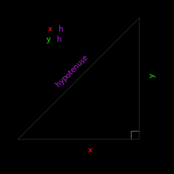
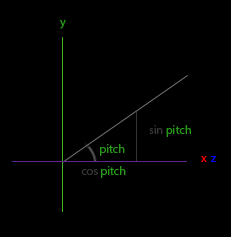

# [Getting Started : Camera](https://learnopengl.com/Getting-started/Camera)

이전 장에서는 뷰 행렬(view matrix)과 뷰 행렬을 사용하여 장면을 움직일 수 있는 방법에 대해 논의했습니다 (우리는 조금 뒤로 움직였습니다). OpenGL 자체는 카메라 개념을 인식하지 못하지만, 장면의 모든 객체를 반대 방향으로 움직여 우리가 움직이는 것처럼 보이도록 시뮬레이션할 수 있습니다.

이번 장에서는 OpenGL에서 카메라를 설정하는 방법에 대해 논의하겠습니다. 3D 장면에서 자유롭게 움직일 수 있는 비행 스타일 카메라에 대해 알아볼 것입니다. 또한 키보드와 마우스 입력에 대해 논의하고, 커스텀 카메라 클래스로 마무리하겠습니다.
<br><br>


## Camera/View space

카메라/뷰 공간(camera/view space)에 대해 언급할 때는, 장면의 원점으로부터 카메라의 관점에서 본 모든 정점 좌표를 의미합니다. 뷰 행렬(view matrix)은 모든 월드 좌표를 카메라의 위치와 방향에 상대적인 뷰 좌표로 변환합니다. 카메라를 정의하기 위해서는 월드 공간에서의 위치, 카메라가 바라보는 방향, 오른쪽을 가리키는 벡터, 그리고 카메라에서 위쪽을 가리키는 벡터가 필요합니다. 주의 깊은 독자는 실제로 카메라의 위치를 원점으로 하는 3개의 직교 단위축으로 이루어진 좌표계를 생성하게 될 것을 알아차릴 수 있을 것입니다.


### 1. Camera position

카메라의 위치를 가져오는 것은 쉽습니다. 카메라 위치는 카메라의 위치를 가리키는 월드 공간에서의 벡터입니다. 이전 장에서와 동일한 위치에 카메라를 설정합니다:

```
glm::vec3 cameraPos = glm::vec3(0.0f, 0.0f, 3.0f);
```

양의 z축이 화면을 통해 당신에게로 향하고 있으므로, 카메라를 뒤로 움직이려면 양의 z축을 따라 이동해야 합니다.

### 2. Camera direction

다음으로 필요한 벡터는 카메라의 방향입니다. 즉, 어느 방향을 가리키고 있는지를 나타냅니다. 일단은 카메라를 장면의 원점 (0, 0, 0)을 가리키도록 설정합니다. 두 벡터를 서로 빼면 두 벡터의 차이를 나타내는 벡터가 얻어짐을 기억하세요. 따라서 장면의 원점 벡터에서 카메라 위치 벡터를 뺀다면 우리가 원하는 방향 벡터가 됩니다. 뷰 행렬의 좌표계에서는 z축이 양수여야 하므로, 관례적으로 (OpenGL에서) 카메라는 음의 z축 방향을 향하도록 설정합니다. 따라서 방향 벡터를 부정하는 것이 필요합니다. 만약 뺄셈 순서를 바꾼다면, 이제 카메라의 양의 z축을 향하는 벡터를 얻을 수 있습니다.

```
glm::vec3 cameraTarget = glm::vec3(0.0f, 0.0f, 0.0f);
glm::vec3 cameraDirection = glm::normalize(cameraPos - cameraTarget);
```

> "direction vector"라는 이름은 실제로 목표하는 방향의 반대 방향을 가리키고 있기 때문에 최적의 이름은 아닙니다.

### 3. Right axis

다음으로 필요한 벡터는 카메라 공간의 양의 x축을 나타내는 오른쪽 벡터입니다. 오른쪽 벡터를 얻기 위해 우선 상향을 가리키는 업 벡터를 지정한 다음, 업 벡터와 2단계에서 얻은 방향 벡터에 대해 외적(cross product)을 수행하는 작은 트릭을 사용합니다. 외적의 결과는 두 벡터에 수직인 벡터이므로, 양의 x축의 방향을 가리키는 벡터를 얻게 될 것입니다 (외적 순서를 바꾸면 음의 x축을 가리키는 벡터를 얻게 됩니다).

```
glm::vec3 up = glm::vec3(0.0f, 1.0f, 0.0f); 
glm::vec3 cameraRight = glm::normalize(glm::cross(up, cameraDirection));
```

### 4. Up axis

이제 x축 벡터와 z축 벡터를 모두 가지고 있으므로, 카메라의 양의 y축을 가리키는 벡터를 가져오는 것은 비교적 쉽습니다. 우리는 오른쪽 벡터와 방향 벡터의 외적을 취하면 됩니다.

```
glm::vec3 cameraUp = glm::cross(cameraDirection, cameraRight);
```

외적과 몇 가지 트릭을 통해 우리는 뷰/카메라 공간을 형성하는 모든 벡터를 생성할 수 있었습니다. 수학적인 경향을 가진 독자들에게는, 이 과정은 선형 대수학에서 그람-슈미트 과정으로 알려져 있습니다. 이러한 카메라 벡터들을 사용하여 카메라를 생성하는 데 매우 유용한 LookAt 행렬을 만들 수 있습니다.

### Look At

행렬의 훌륭한 점은, 3개의 직교(또는 비선형) 축을 사용하여 좌표 공간을 정의한다면, 해당 3개의 축과 이동 벡터를 포함한 행렬을 생성하여 이 행렬로 어떤 벡터든 해당 좌표 공간으로 변환할 수 있다는 것입니다. 이것이 바로 LookAt 행렬이 하는 일이며, 이제 3개의 직교 축과 위치 벡터를 사용하여 카메라 공간을 정의할 수 있으므로, 우리 자신의 LookAt 행렬을 만들 수 있습니다.


여기서 $R$은 오른쪽 벡터, $U$는 위쪽 벡터, $D$는 방향 벡터, $P$는 카메라의 위치 벡터입니다. 회전 부분(왼쪽 행렬)과 이동 부분(오른쪽 행렬)이 역전되어 있음에 유의하십시오 (각각 전치되고 부호가 반대되었습니다). 이는 카메라를 움직이고자 하는 방향의 반대로 세계를 회전 및 이동시키기를 원하기 때문입니다. 이 LookAt 행렬을 뷰 행렬로 사용하면, 우리가 방금 정의한 뷰 공간으로 모든 월드 좌표가 효과적으로 변환됩니다. 그런 다음 LookAt 행렬은 정확히 이야기하는 대로, 주어진 대상을 바라보는 뷰 행렬을 생성합니다.

다행히도, GLM은 이미 이 모든 작업을 대신 해줍니다. 우리는 카메라 위치, 대상 위치, 그리고 월드 공간에서 위쪽 벡터를 나타내는 벡터만 지정하면 됩니다 (오른쪽 벡터를 계산하는 데 사용한 위쪽 벡터). 그러면 GLM은 우리가 뷰 행렬로 사용할 수 있는 LookAt 행렬을 생성합니다.

```
glm::mat4 view;
view = glm::lookAt(glm::vec3(0.0f, 0.0f, 3.0f), 
  		   glm::vec3(0.0f, 0.0f, 0.0f), 
  		   glm::vec3(0.0f, 1.0f, 0.0f));
```

glm::LookAt 함수는 각각 위치(position), 대상(target), 위쪽(up) 벡터를 필요로 합니다. 이 예제는 이전 장에서 만든 뷰 행렬과 동일한 뷰 행렬을 생성합니다.

사용자 입력에 들어가기 전에, 먼저 장면을 기준으로 카메라를 회전시켜 보겠습니다. 우리는 장면의 대상을 (0,0,0)으로 유지합니다. 우리는 삼각함수를 약간 사용하여 매 프레임마다 원 위의 한 점을 나타내는 x와 z 좌표를 만들고, 이를 카메라 위치로 사용할 것입니다. 시간이 지남에 따라 x와 y 좌표를 재계산하면 원 안의 모든 점을 순회하게 되므로, 카메라는 장면을 중심으로 회전하게 됩니다. 미리 정의된 반지름으로 이 원을 확대하고, GLFW의 glfwGetTime 함수를 사용하여 각 프레임마다 새로운 뷰 행렬을 생성합니다.

```
const float radius = 10.0f;
float camX = sin(glfwGetTime()) * radius;
float camZ = cos(glfwGetTime()) * radius;
glm::mat4 view;
view = glm::lookAt(glm::vec3(camX, 0.0, camZ), glm::vec3(0.0, 0.0, 0.0), glm::vec3(0.0, 1.0, 0.0)); 
```

이 코드를 실행하면 다음과 같은 결과를 얻을 수 있어야 합니다:


이 작은 코드 스니펫을 사용하면 카메라가 시간이 지남에 따라 장면 주위를 돕니다. LookAt 행렬이 작동하는 방식을 알아보기 위해 반지름 및 위치/방향 매개변수를 실험해 보세요. 또한 문제가 생기면 [소스 코드](../../02.GettingStarted/09.Camera.01/main.cpp)를 확인해보세요.
<br><br>


## Walk around

장면 주위를 카메라로 돌리는 것도 재미있지만, 모든 움직임을 직접 제어하는 것이 더 재미있습니다! 먼저 카메라 시스템을 설정해야 하므로 프로그램 상단에 몇 가지 카메라 변수를 정의하는 것이 유용합니다:

```
glm::vec3 cameraPos   = glm::vec3(0.0f, 0.0f,  3.0f);
glm::vec3 cameraFront = glm::vec3(0.0f, 0.0f, -1.0f);
glm::vec3 cameraUp    = glm::vec3(0.0f, 1.0f,  0.0f);
```

LookAt 함수는 이제 다음과 같이 됩니다:

```
view = glm::lookAt(cameraPos, cameraPos + cameraFront, cameraUp);
```

먼저 카메라 위치를 이전에 정의된 cameraPos로 설정합니다. 방향은 현재 위치 + 방향 벡터로 설정됩니다. 이렇게 함으로써 어떻게 움직이든지 카메라가 목표 방향을 바라보도록 유지됩니다. 이 변수들을 조금 놀아보기 위해 키를 누를 때 cameraPos 벡터를 업데이트하는 것이 좋습니다.

우리는 이미 GLFW의 키보드 입력을 관리하기 위해 processInput 함수를 정의했으므로, 몇 가지 추가적인 키 명령을 추가해 보겠습니다.

```
void processInput(GLFWwindow *window)
{
    ...
    const float cameraSpeed = 0.05f; // adjust accordingly
    if (glfwGetKey(window, GLFW_KEY_W) == GLFW_PRESS)
        cameraPos += cameraSpeed * cameraFront;
    if (glfwGetKey(window, GLFW_KEY_S) == GLFW_PRESS)
        cameraPos -= cameraSpeed * cameraFront;
    if (glfwGetKey(window, GLFW_KEY_A) == GLFW_PRESS)
        cameraPos -= glm::normalize(glm::cross(cameraFront, cameraUp)) * cameraSpeed;
    if (glfwGetKey(window, GLFW_KEY_D) == GLFW_PRESS)
        cameraPos += glm::normalize(glm::cross(cameraFront, cameraUp)) * cameraSpeed;
}
```

WASD 키 중 하나를 누르면 카메라의 위치가 그에 따라 업데이트됩니다. 전진 또는 후진을 원한다면, 일정한 속도 값으로 스케일된 방향 벡터를 위치 벡터에 더하거나 빼줍니다. 좌우로 이동하려면 외적을 사용하여 오른쪽 벡터를 생성하고 오른쪽 벡터를 따라 이동합니다. 이렇게 함으로써 카메라를 사용할 때 익숙한 좌우로의 이동 효과를 얻을 수 있습니다.

> 결과로 나오는 오른쪽 벡터를 정규화(normalize)합니다. 만약 이 벡터를 정규화하지 않으면, 결과로 나오는 외적은 cameraFront 변수에 따라 크기가 다른 벡터를 반환할 수 있습니다. 벡터를 정규화하지 않는다면, 일정한 이동 속도 대신 카메라의 방향에 따라 느리게 또는 빠르게 움직이게 될 것입니다.

지금까지, 시스템에 따라 다른 속도로 카메라를 움직일 수 있어야 하지만, 일관된 이동 속도로 조정해야 할 수도 있으므로 cameraSpeed를 조정해야 할 수도 있습니다.

### Movement speed

현재 우리는 주위를 돌아다닐 때 이동 속도에 대해 상수 값을 사용했습니다. 이론적으로는 괜찮아 보이지만, 실제로는 사용자들의 기기에는 다양한 처리 능력이 있으며, 그 결과로 인해 각 사용자는 매 초마다 다른 프레임을 렌더링할 수 있습니다. 한 사용자가 다른 사용자보다 더 많은 프레임을 렌더링하는 경우 그 사용자는 더 자주 processInput을 호출하게 됩니다. 그 결과로 일부 사용자는 설정에 따라 아주 빠르게 이동하고 일부 사용자는 아주 느리게 이동하게 됩니다. 애플리케이션을 배포할 때는 다양한 하드웨어에서 동일하게 실행되도록 하고 싶습니다.

일반적으로 그래픽 애플리케이션과 게임은 마지막 프레임을 렌더링하는 데 걸린 시간을 저장하는 deltatime 변수를 추적합니다. 그런 다음 모든 속도에 이 deltaTime 값을 곱합니다. 이렇게 함으로써 한 프레임에서 deltaTime이 큰 경우, 즉 마지막 프레임이 평균보다 오래 걸린 경우 해당 프레임의 속도도 조금 더 높아지게 되어 균형을 맞출 수 있습니다. 이 접근 방식을 사용하면 매우 빠른 또는 느린 컴퓨터를 사용하더라도 카메라의 속도가 해당 컴퓨터에 따라 균형을 맞추어 사용자들이 동일한 경험을 할 수 있습니다.

deltaTime 값을 계산하기 위해 2개의 전역 변수를 추적합니다:

```
float deltaTime = 0.0f;	// Time between current frame and last frame
float lastFrame = 0.0f; // Time of last frame
```

각 프레임 내에서 나중에 사용할 새로운 deltaTime 값을 계산합니다:

```
float currentFrame = glfwGetTime();
deltaTime = currentFrame - lastFrame;
lastFrame = currentFrame;  
```

이제 deltaTime을 고려하여 속도를 계산할 수 있습니다:

```
void processInput(GLFWwindow *window)
{
    float cameraSpeed = 2.5f * deltaTime;
    [...]
}
```

deltaTime을 사용하기 때문에 카메라는 이제 초당 2.5 유닛의 일정한 속도로 움직일 것입니다. 이전 섹션과 함께 사용하면 장면을 이동하는 데 훨씬 더 부드럽고 일관된 카메라 시스템을 갖게 될 것입니다.


이제 우리는 어떤 시스템에서도 동일한 속도로 걷고 보는 카메라를 갖게 되었습니다. 다시 말하지만, [코드](../../02.GettingStarted/09.Camera.02/main.cpp)를 확인하면 도움이 될 것입니다. 우리는 이동과 관련된 모든 것에서 deltaTime 값을 자주 사용할 것입니다.
<br><br>


## Look around

키보드 키만 사용해서 움직이는 것은 그다지 흥미로운 일이 아닙니다. 특히 우리가 회전할 수 없어서 움직임이 제한되는 상황에서는 더 그렇습니다. 이때 마우스가 필요합니다!

장면을 둘러보기 위해 우리는 마우스의 입력에 따라 cameraFront 벡터를 변경해야 합니다. 그러나 마우스 회전에 따라 방향 벡터를 변경하는 것은 약간 복잡하며 삼각법이 필요합니다. 삼각법을 이해하지 못하더라도 걱정하지 마세요. 코드 섹션으로 건너뛰어 코드를 복사하여 사용할 수 있습니다. 나중에 더 자세히 알고 싶다면 언제든 돌아올 수 있습니다.

### Euler angles

오일러 각은 1700년대에 Leonhard Euler가 정의한 3차원에서의 회전을 나타낼 수 있는 3개의 값입니다. 피치(Pitch), 요우(Yaw), 롤(Roll)이라는 3개의 오일러 각이 있습니다. 다음 이미지는 이들에게 시각적인 의미를 부여합니다:


피치는 첫 번째 이미지에서 위를 올려다보거나 아래를 내려다보는 정도를 나타내는 각도입니다. 두 번째 이미지는 좌우로 바라보는 크기를 나타내는 요우 값을 보여줍니다. 롤은 주로 우주 비행 카메라에서 사용되며 회전 정도를 나타냅니다. 각 오일러 각은 하나의 값으로 표현되며, 이들의 조합으로 3차원에서 어떤 회전 벡터든 계산할 수 있습니다.

카메라 시스템에서는 요우와 피치 값만 신경쓰므로 롤 값에 대해서는 여기서 다루지 않을 것입니다. 주어진 피치와 요우 값을 사용하여 새로운 방향 벡터를 나타내는 3D 벡터로 변환할 수 있습니다. 요우와 피치 값을 방향 벡터로 변환하는 과정에는 약간의 삼각법이 필요합니다. 기본적인 경우로 시작해보겠습니다:

조금 복습을 해보고 일반적인 직각 삼각형 케이스를 확인해봅시다 (한 변이 90도 각을 이루는 경우):



만약 빗변의 길이를 1로 정의한다면, 삼각법(사인, 코사인, 탄젠트)에 따라 우리는 인접한 변의 길이가 $cos(x) / h = cos(x) / 1 = cos(x)$이고, 맞은편 변의 길이가 $sin(y) / h = sin(y) / 1 = sin(y)$임을 알 수 있습니다. 이는 주어진 각도에 따라 x축과 y축의 길이를 검출하는 일반적인 공식을 제공합니다. 이를 사용하여 방향 벡터의 성분을 계산해보겠습니다.

같은 삼각형을 상단 시각에서 보는 것으로 상상해봅시다. 이때, 인접한 변과 맞은편 변이 장면의 x축과 z축과 평행하도록 배치된 것으로 가정합니다(마치 y축을 따라 아래를 내려다보는 것과 같이).


만약 우리가 x축을 기준으로 반시계 방향으로 회전하는 yaw 각도를 시각화한다면, x축의 길이는 cos(yaw)와 관련이 있음을 알 수 있습니다. 비슷하게, z축의 길이는 sin(yaw)와 관련이 있습니다.

이러한 지식과 주어진 yaw 값으로 카메라의 방향 벡터를 생성할 수 있습니다:

```
glm::vec3 direction;
direction.x = cos(glm::radians(yaw)); // Note that we convert the angle to radians first
direction.z = sin(glm::radians(yaw));
```

이렇게 하면 yaw 값을 통해 3D 방향 벡터를 얻을 수 있지만, pitch도 포함되어야 합니다. 이제 xz 평면에 앉아 y축 측면을 살펴보겠습니다:



마찬가지로, 이 삼각형에서 방향 벡터의 y 성분은 $sin(pitch)$와 같음을 알 수 있으므로, 이를 적용해 봅시다:

```
direction.y = sin(glm::radians(pitch));
```

그러나, pitch 삼각형에서 우리는 xz 면도 $cos(pitch)$에 영향을 받는다는 것을 알 수 있으므로, 방향 벡터에 이를 포함해야 합니다. 이를 포함하여 최종 방향 벡터를 얻을 수 있으며, 이는 yaw와 pitch Euler 각도에서 변환된 것입니다:

```
direction.x = cos(glm::radians(yaw)) * cos(glm::radians(pitch));
direction.y = sin(glm::radians(pitch));
direction.z = sin(glm::radians(yaw)) * cos(glm::radians(pitch));
```

이렇게 하면 yaw와 pitch 값을 3차원 방향 벡터로 변환하는 공식을 얻을 수 있으며, 이를 사용하여 주변을 둘러보기 위해 활용할 수 있습니다.

우리는 장면 세계를 설정하여 모든 것이 음의 z축 방향으로 배치되었습니다. 그러나 x와 z yaw 삼각형을 살펴보면 각도 0은 카메라의 방향 벡터가 양의 x축을 향하도록 만듭니다. 기본값으로 카메라가 음의 z축을 향하도록 하기 위해 우리는 yaw에 90도의 시계 방향 회전을 기본값으로 설정할 수 있습니다. 양수 각도는 반시계 방향으로 회전하므로, 기본 yaw 값을 다음과 같이 설정합니다:

```
yaw = -90.0f;
```

이제 여러분은 아마 궁금해졌을 것입니다. 어떻게 yaw와 pitch 값을 설정하고 수정할 수 있는 것일까요?

### Mouse input

Yaw와 Pitch 값은 마우스 (또는 컨트롤러/조이스틱) 움직임에서 얻어집니다. 가로 마우스 움직임은 yaw에 영향을 주고, 세로 마우스 움직임은 pitch에 영향을 줍니다. 아이디어는 마지막 프레임의 마우스 위치를 저장하고, 현재 프레임에서 마우스 값이 얼마나 변경되었는지 계산하는 것입니다. 가로 또는 세로 차이가 클수록 pitch 또는 yaw 값을 업데이트하고, 따라서 카메라의 움직임도 그만큼 많이 이동해야 합니다.

먼저 GLFW에게 커서를 숨기고 캡처하도록 지시해야 합니다. 커서를 캡처하는 것은 응용 프로그램이 포커스를 가질 때 마우스 커서가 창의 중앙에 고정되는 것을 의미합니다 (응용 프로그램이 포커스를 잃거나 종료하지 않는 한). 이 작업은 간단한 구성 호출로 수행할 수 있습니다:

```
glfwSetInputMode(window, GLFW_CURSOR, GLFW_CURSOR_DISABLED);  
```

이 호출 이후에는 마우스를 어디로 이동시키든지 보이지 않게 되고, 창을 벗어나지 않아야 합니다. 이는 FPS 카메라 시스템에 이상적입니다.

피치와 요 값 계산을 위해 GLFW에게 마우스 이동 이벤트를 수신하도록 지시해야 합니다. 이를 위해 다음과 같은 프로토타입의 콜백 함수를 생성합니다:

```
void mouse_callback(GLFWwindow* window, double xpos, double ypos);
```

여기서 xpos와 ypos는 현재 마우스 위치를 나타냅니다. GLFW에 콜백 함수를 등록하면 마우스가 이동할 때마다 mouse_callback 함수가 호출됩니다.

```
glfwSetCursorPosCallback(window, mouse_callback);
```

플라이 스타일 카메라의 마우스 입력을 처리할 때는 다음과 같은 몇 가지 단계를 거쳐 카메라의 방향 벡터를 완전히 계산할 수 있습니다:

1. 이전 프레임 이후의 마우스 오프셋을 계산합니다.
2. 오프셋 값을 카메라의 요와 피치 값에 더합니다.
3. 최소/최대 피치 값을 제한합니다.
4. 방향 벡터를 계산합니다.

첫 번째 단계는 이전 프레임 이후의 마우스 오프셋을 계산하는 것입니다. 먼저 응용 프로그램에서 마지막 마우스 위치를 저장해야 하는데, 초기값은 화면의 중앙(화면 크기는 800x600)으로 설정합니다:

```
float lastX = 400, lastY = 300;
```

그런 다음 마우스의 콜백 함수에서 마지막과 현재 프레임 간의 오프셋 이동을 계산합니다:

```
float xoffset = xpos - lastX;
float yoffset = lastY - ypos; // reversed since y-coordinates range from bottom to top
lastX = xpos;
lastY = ypos;

const float sensitivity = 0.1f;
xoffset *= sensitivity;
yoffset *= sensitivity;
```

오프셋 값을 민감도 값으로 곱하는 것에 주목하세요. 이 곱셈을 생략하면 마우스 이동이 너무 강하게 나타날 것입니다. 민감도 값을 조정하여 원하는 대로 조절해보세요.

그다음 오프셋 값을 전역으로 선언된 pitch와 yaw 값에 추가합니다:

```
yaw   += xoffset;
pitch += yoffset;  
```

세 번째 단계에서는 사용자가 이상한 카메라 움직임을 할 수 없도록 제약 조건을 추가하려고 합니다(또한 방향 벡터가 세계의 위쪽 방향과 평행할 때 LookAt이 반전됩니다). 피치는 사용자가 89도보다 높게 볼 수 없도록 제한되어야 하며 (-89도보다 낮게도), 이렇게 하면 사용자가 하늘을 볼 수 있거나 발 아래를 볼 수 있지만 더 멀리 볼 수는 없습니다. 제약 조건은 제약 조건을 위반할 때마다 오일러 값을 해당 제약 조건 값으로 대체함으로써 작동합니다:

```
if(pitch > 89.0f)
  pitch =  89.0f;
if(pitch < -89.0f)
  pitch = -89.0f;
```

yaw 값에는 제약 조건을 설정하지 않았다는 점에 유의하세요. 수평 회전에서 사용자를 제약하고 싶지 않기 때문입니다. 그러나 원한다면 yaw에 대한 제약 조건도 쉽게 추가할 수 있습니다.

네 번째이자 마지막 단계는 이전 섹션의 공식을 사용하여 실제 방향 벡터를 계산하는 것입니다.

```
glm::vec3 direction;
direction.x = cos(glm::radians(yaw)) * cos(glm::radians(pitch));
direction.y = sin(glm::radians(pitch));
direction.z = sin(glm::radians(yaw)) * cos(glm::radians(pitch));
cameraFront = glm::normalize(direction);
```

계산된 방향 벡터에는 마우스의 움직임에서 계산된 모든 회전이 포함됩니다. cameraFront 벡터는 이미 glm의 lookAt 함수에 포함되어 있으므로 사용할 준비가 되었습니다.

이제 코드를 실행하면 창이 마우스 커서의 포커스를 처음 받을 때 카메라가 큰 돌진을하는 것을 알 수 있습니다. 이러한 급격한 돌진의 원인은 커서가 창에 들어가자마자 마우스 콜백 함수가 xpos 및 ypos 위치와 함께 호출되기 때문입니다. 이 위치는 화면 중앙으로부터 상당히 멀리 떨어진 위치 일반적으로 큰 오프셋과 따라서 큰 움직임 동작을 유발합니다. 이 문제를 우회하기 위해 전역 bool 변수를 정의하여 이것이 처음으로 마우스 입력을 받는지 확인할 수 있습니다. 처음인 경우 초기 마우스 위치를 새로운 xpos 및 ypos 값으로 업데이트합니다. 결과적으로 마우스 움직임은 새로 입력된 마우스 위치 좌표를 사용하여 오프셋을 계산합니다.

```
if (firstMouse) // initially set to true
{
    lastX = xpos;
    lastY = ypos;
    firstMouse = false;
}
```

최종 코드는 다음과 같습니다:

```
void mouse_callback(GLFWwindow* window, double xpos, double ypos)
{
    if (firstMouse)
    {
        lastX = xpos;
        lastY = ypos;
        firstMouse = false;
    }
  
    float xoffset = xpos - lastX;
    float yoffset = lastY - ypos; 
    lastX = xpos;
    lastY = ypos;

    float sensitivity = 0.1f;
    xoffset *= sensitivity;
    yoffset *= sensitivity;

    yaw   += xoffset;
    pitch += yoffset;

    if(pitch > 89.0f)
        pitch = 89.0f;
    if(pitch < -89.0f)
        pitch = -89.0f;

    glm::vec3 direction;
    direction.x = cos(glm::radians(yaw)) * cos(glm::radians(pitch));
    direction.y = sin(glm::radians(pitch));
    direction.z = sin(glm::radians(yaw)) * cos(glm::radians(pitch));
    cameraFront = glm::normalize(direction);
}  
```

잘 했어요! 한번 실행해보면 3D 장면을 자유롭게 이동할 수 있음을 확인할 수 있을 거예요!

### zoom

추가로 카메라 시스템에 줌 인터페이스를 구현해보겠습니다. 이전 장에서 우리는 시야각(Field of View 또는 fov)이 장면에서 얼마나 많은 부분을 볼 수 있는지를 크게 결정한다고 말했습니다. 시야각이 작아지면 장면의 투영 공간도 작아집니다. 이 작은 공간이 동일한 NDC에 투영되므로 확대된 효과를 줄 수 있습니다. 확대 기능은 마우스의 스크롤 휠을 사용할 것입니다. 마우스 스크롤링에 대한 콜백 함수도 마우스 이동과 키보드 입력과 마찬가지로 존재합니다:

```
void scroll_callback(GLFWwindow* window, double xoffset, double yoffset)
{
    fov -= (float)yoffset;
    if (fov < 1.0f)
        fov = 1.0f;
    if (fov > 45.0f)
        fov = 45.0f; 
}
```

스크롤할 때 yoffset 값은 수직으로 스크롤한 양을 나타냅니다. scroll_callback 함수가 호출될 때 전역으로 선언된 fov 변수의 내용을 변경합니다. 45.0이 기본 fov 값이므로 확대 수준을 1.0과 45.0 사이로 제한하려고 합니다.

이제 매 프레임마다 투영 행렬을 GPU에 업로드해야 합니다. 이번에는 fov 변수를 시야각으로 사용하여 업로드하겠습니다:

```
projection = glm::perspective(glm::radians(fov), 800.0f / 600.0f, 0.1f, 100.0f);
```

마지막으로 scroll 콜백 함수를 등록하는 것을 잊지 마세요:

```
glfwSetScrollCallback(window, scroll_callback);
```

여기까지입니다. 우리는 3D 환경에서 자유로운 이동을 가능하게 하는 간단한 카메라 시스템을 구현했습니다.


자유롭게 실험해보세요. 만약 막힌 부분이 있다면 [소스 코드](../../02.GettingStarted/09.Camera.03/main.cpp)와 비교해보세요.
<br><br>


## Camera class

다음 장에서는 각도를 조정하여 씬을 모든 각도에서 살펴볼 수 있는 간편한 카메라를 사용할 것입니다. 그러나 카메라 코드는 각 장마다 상당한 공간을 차지할 수 있으므로 이를 약간 추상화하고 우리에게 필요한 대부분의 작업을 수행하는 자체 카메라 객체를 만들 것입니다. 셰이더 챕터와 달리 카메라 클래스를 만드는 과정을 안내해 드리지는 않지만, 내부 동작 방식을 알고 싶다면 주석이 달린 소스 코드를 제공해 드릴 것입니다.

셰이더 개체와 마찬가지로, 카메라 클래스를 전적으로 하나의 헤더 파일에 정의합니다. [여기서](../../02.GettingStarted/09.Camera.04/Camera.h) 카메라 클래스를 찾을 수 있으며, 이번 챕터 이후에 코드를 이해할 수 있을 것입니다. 자체 카메라 시스템을 만드는 방법에 대한 예로서 최소한 한 번은 해당 클래스를 확인하는 것이 좋습니다.

> 우리가 소개한 카메라 시스템은 대부분의 용도에 적합한 비행 카메라이며 오일러 각도와 잘 작동하지만, FPS 카메라나 비행 시뮬레이션 카메라와 같은 다른 카메라 시스템을 생성할 때 주의해야 합니다. 각각의 카메라 시스템은 자체적인 요령과 특징이 있으므로 이에 대해 자세히 읽어보는 것이 좋습니다. 예를 들어, 이 비행 카메라는 90도 이상 또는 90도와 같은 피치 값이 허용되지 않으며 (0, 1, 0)의 정적인 위쪽 벡터는 롤 값을 고려할 때 작동하지 않습니다.

새로운 카메라 개체를 사용한 업데이트된 [소스 코드](../../02.GettingStarted/09.Camera.04/main.cpp) 버전은 여기에서 찾을 수 있습니다.