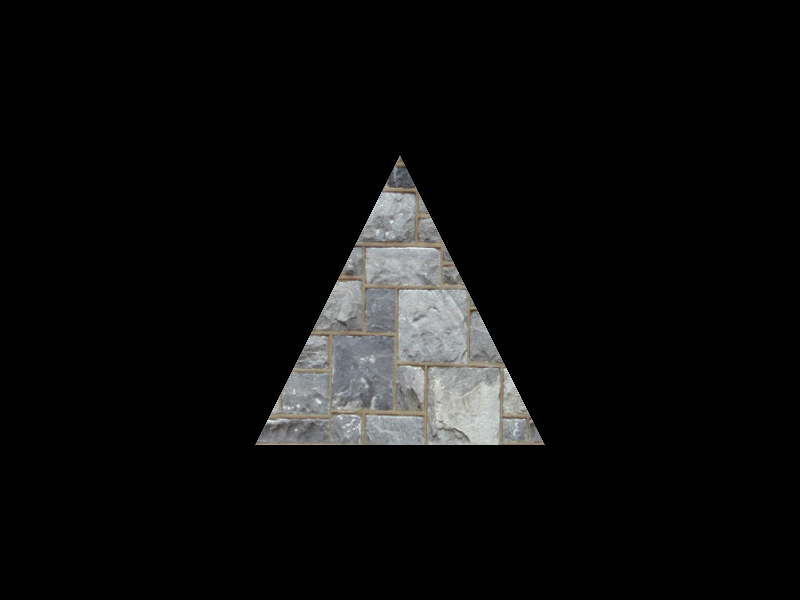
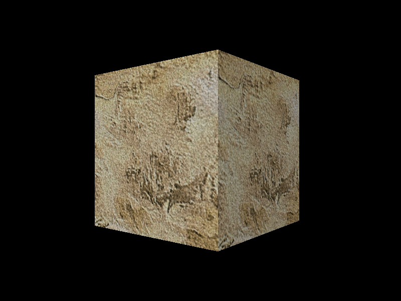
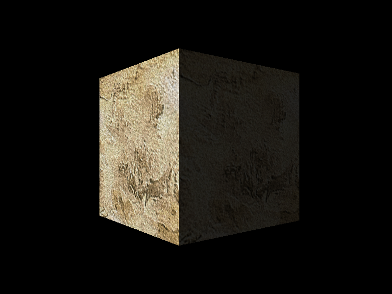
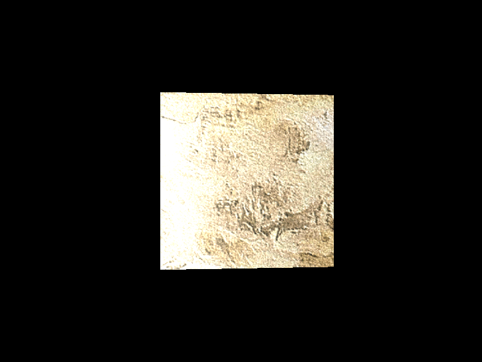

# [RasterTek](https://www.rastertek.com/tutindex.html)
- RasterTek의 `DirectX 11 Tutorial` 실습 코드 저장소입니다.
<br><br>

## Requirements

이 실습 코드를 빌드하기 위해서는 다음이 필요합니다.

- Visual Studio 2019 이상
- CMake 3.27.0 이상
<br><br>


## How to use `GenerateProjectFiles.bat`?

`GenerateProjectFiles.bat`를 사용하기 위해서는 `CMD`를 실행한 뒤에 다음 명령어를 입력합니다.

```
> GenerateProjectFiles.bat <your-visual-studio>
```

- Visual Studio 2019 가 설치되어 있는 경우
  ```
  > GenerateProjectFiles.bat vs2019
  ```
- Visual Studio 2022 가 설치되어 있는 경우
  ```
  > GenerateProjectFiles.bat vs2022
  ```


## Tutorial

### [Tutorial 02 : Creating a Framework and Window](./Tutorial02/)


### [Tutorial 03 : Initializing DirectX 11](./Tutorial03/)


### [Tutorial 04 : Buffers, Shaders, and HLSL](./Tutorial04/)


### [Tutorial 05 : Texturing](./Tutorial05/)


### [Tutorial 06 : Diffuse Lighting](./Tutorial06/)


### [Tutorial 07 : 3D Model Rendering](./Tutorial07/)


### Tutorial 08 : Loading Maya Models
- 코드 없음

### [Tutorial 09 : Ambient Lighting](./Tutorial09/)


### [Tutorial 10 : Specular Lighting](./Tutorial10/)
